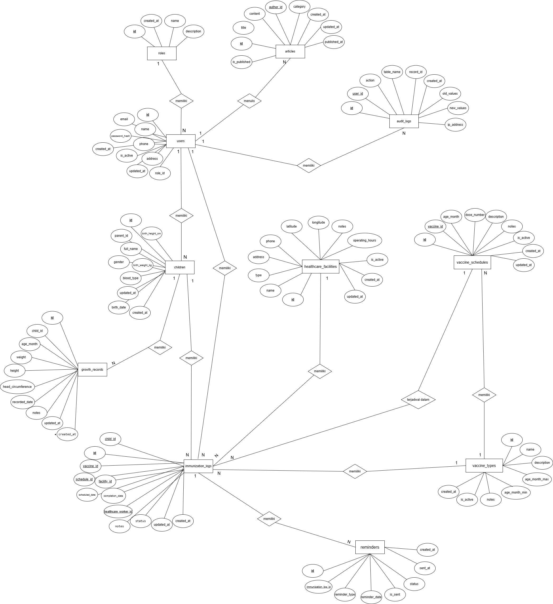
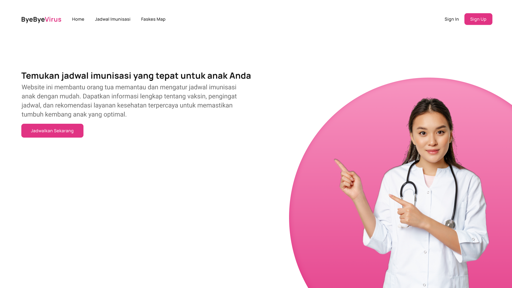
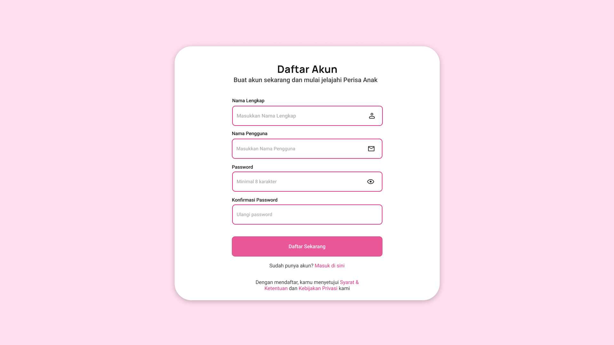
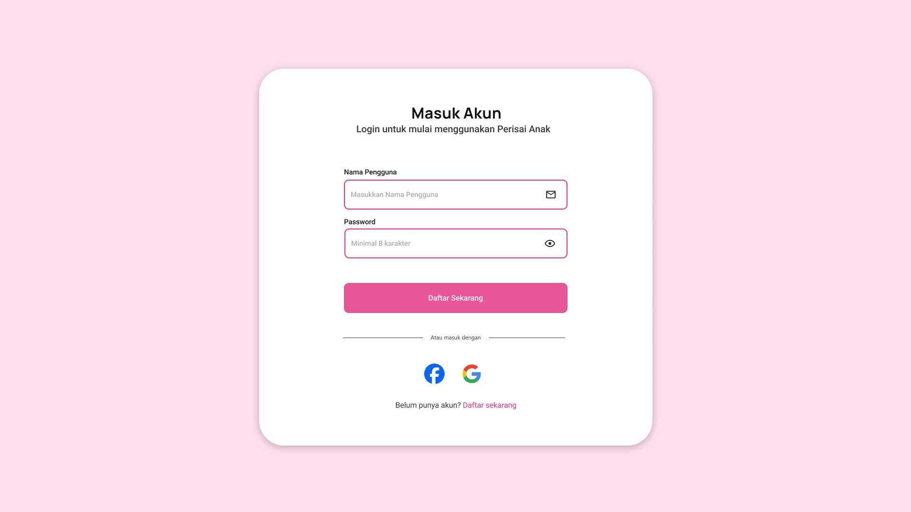
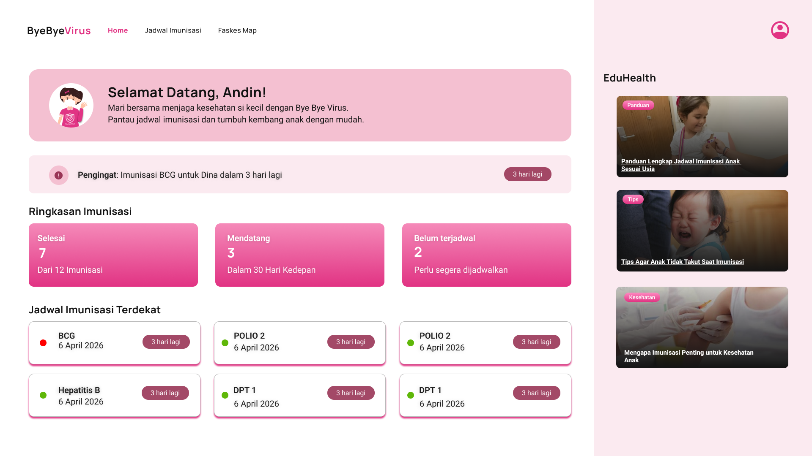

# ☁️ Cloud App - [Bye bye virus]

Bye bye Virus adalah aplikasi yang dirancang untuk memantau dan mengelola imunisasi serta tumbuh kembang anak. Aplikasi ini menyediakan solusi komperehensif yang bertujuan untuk memastikan bahwa setiap anak menerima perlindungan kesehatan yang memadai dan mencapai potensi perkembangannya secara maksimal.

Masalah yang sering dihadapi orang tua terutama yang baru memiliki anak dan sedang bekerja, biasanya sering terlewat jadwal imunisasi dikarenakan tidak adanya informasi atau pengingat secara berkala. Aplikasi ini hadir untuk memudahkan para orang tua (ibu rumah tangga maupun yang sedang bekerja) dalam merencanakan dan menjadwalkan imunisasi anak mereka.

---

## 📊 Project Status ✅

| Component          | Status         | Progress                    |
| ------------------ | -------------- | --------------------------- |
| **Backend Core**   | ✅ COMPLETE    | 100%                        |
| **Database**       | ✅ COMPLETE    | 100%                        |
| **API Endpoints**  | ✅ COMPLETE    | 35+ endpoints               |
| **Authentication** | ✅ COMPLETE    | JWT + bcrypt                |
| **Documentation**  | ✅ COMPLETE    | 5 comprehensive guides      |
| **Frontend**       | 🏗️ IN PROGRESS | 40% (needs API integration) |
| **Testing**        | 🧪 READY       | Setup complete              |
| **Deployment**     | 🚀 READY       | Railway/Render/Docker       |

---
## 📅 Roadmap

| Minggu | Target                 | Status |
| ------ | ---------------------- | ------ |
| 1      | Setup & Hello World    | ✅     |
| 2      | REST API + Database    | ✅     |
| 3      | React Frontend         | ✅     |
| 4      | Full-Stack Integration | ✅     |
| 5-7    | Docker & Compose       | ⬜     |
| 8      | UTS Demo               | ⬜     |
| 9-11   | CI/CD Pipeline         | ⬜     |
| 12-14  | Microservices          | ⬜     |
| 15-16  | Final & UAS            | ⬜     |

---

## 👥 Tim

| Nama                 | NIM      | Peran          |
| -------------------- | -------- | -------------- |
| Ahmad Daffa Alfattah | 10231008 | Lead Backend   |
| Nazwa Amelia Zahra   | 10231068 | Lead Frontend  |
| Cintya Widhi Astuti  | 10231026 | Lead DevOps    |
| Verina Rahma Dinah   | 10231090 | Lead QA & Docs |

## 🛠️ Tech Stack

| Teknologi      | Fungsi           | Keterangan                                                                                                                                   |
| -------------- | ---------------- | -------------------------------------------------------------------------------------------------------------------------------------------- |
| FastAPI        | Backend REST API | Membangun layanan backend berbasis REST API yang menangani logika aplikasi, pengolahan data, dan komunikasi dengan database                  |
| React          | Frontend SPA     | Membangun antarmuka pengguna berbasis Single Page Application yang interaktif, responsif, dan mampu berkomunikasi dengan backend melalui API |
| PostgreSQL     | Database         | Menyimpan data aplikasi secara terstruktur                                                                                                   |
| Docker         | Containerization | Mengemas aplikasi dan seluruh dependensinya ke dalam container sehingga aplikasi bisa berjalan konsisten di lingkungan manapun               |
| GitHub Actions | CI/CD            | Mengotomatiskan proses pengujian, build, dan deployment aplikasi                                                                             |
| Railway/Render | Cloud Deployment | Melakukan deployment aplikasi ke cloud agar backend dan frontend dapat berjalan dan diakses secara online                                    |

## 🏗️ Architecture

```
Frontend (React)
        ↓ HTTP Request
Backend (FastAPI - Python)
        ↓ SQL Query
Database (PostgreSQL)
```

_(Diagram ini akan berkembang setiap minggu)_

## 📁 Struktur File

```
cloud-team-stranger_things/
├── backend/
|   ├── Dockerfile           ← BARU
│   ├── .dockerignore        ← BARU
│   ├── main.py              ← Updated (auth endpoints, CORS fix)
│   ├── auth.py              ← BARU (JWT utilities)
│   ├── database.py
│   ├── models.py            ← Updated (+ User model)
│   ├── schemas.py           ← Updated (+ auth schemas)
│   ├── crud.py              ← Updated (+ user CRUD)
│   ├── requirements.txt     ← Updated (+ jose, passlib, bcrypt)
│   ├── .env                 ← Updated (+ JWT & CORS config)
│   └── .env.example         ← Updated
├── frontend/
│   ├── src/
│   │   ├── App.jsx              ← Updated (auth integration)
│   │   ├── components/
│   │   │   ├── Header.jsx       ← Updated (+ user info, logout)
│   │   │   ├── LoginPage.jsx    ← BARU
│   │   │   ├── SearchBar.jsx
│   │   │   ├── ItemForm.jsx
│   │   │   ├── ItemList.jsx
│   │   │   └── ItemCard.jsx
│   │   └── services/
│   │       └── api.js           ← Updated (+ auth, token mgmt)
│   ├── .env
│   └── .env.example
├── .gitignore
└── README.md
```


## 🚀 Getting Started

### Prasyarat

#### 1. Python 3.10+

Python digunakan untuk menjalankan backend yang dibangun menggunakan FastAPI. Versi minimal 3.10+ diperlukan karena kompatibel dengan dependensi modern FastAPI.
Digunakan untuk:

- Menjalankan server API dengan `uvicorn`
- Mengelola dependensi menggunakan `pip`
- Menjalankan logika backend aplikasi

Tanpa Python, backend tidak dapat dijalankan.

#### 2. Node.js 18+

Node.js digunakan untuk menjalankan frontend berbasis React. Versi minimal 18+ direkomendasikan karena mendukung fitur JavaScript modern dan kompatibel dengan Vite.
Digunakan untuk:

- Menginstall dependencies dengan `npm install`
- Menjalankan development server dengan `npm run dev`
- Mengelola package frontend

Tanpa Node.js, frontend tidak dapat dijalankan.

#### 3. Git

Git digunakan sebagai sistem version control dalam pengembangan proyek. Berfungsi untuk:

- Meng-clone repository
- Mengelola perubahan kode
- Mendukung kolaborasi tim
- Integrasi dengan GitHub dan CI/CD

Walaupun aplikasi tetap bisa dijalankan tanpa Git (jika file sudah tersedia), Git sangat penting dalam proses pengembangan dan deployment.

## 📖  Quick Start

```bash
# 1. Setup Database
psql -U postgres -d bye_virus -f backend/database_schema_postgre.sql

# 2. Install Dependencies
cd backend
pip install -r requirements.txt

# 3. Run Backend
uvicorn main:app --reload

# 4. Open API Documentation
# http://localhost:8000/docs

# 5. Run Frontend (di terminal baru)
cd frontend
npm install
npm run dev
```

Panduan langkah-langkah yang lengkap untuk menjalankan proyek ini dapat dilihat di [Setup Guide](docs/setup-guide.md).

## 🔧Backend

Backend pada aplikasi Perisai Anak / Bye Bye Virus akan dibangun menggunakan FastAPI, yaitu framework Python modern yang dirancang untuk membangun REST API .

**Rencana Logika Backend**
1. Sistem Autentikasi\
Bye Bye Virus menggunakan:

   - JWT (JSON Web Token) untuk autentikasi
   - bcrypt untuk hashing password
   - Role-Based Access Control untuk membatasi akses berdasarkan role:
      - parent
      - health_worker
  
2. Data Schema\
Untuk mendukung kebutuhan aplikasi, data utama yang dikelola meliputi:
    - **Users:** menyimpan data akun orang tua / tenaga kesehatan
    - **Children:** menyimpan profil anak
    - **Vaccine Schedule:** master jadwal imunisasi berdasarkan usia
    - **Immunization Logs:** catatan status imunisasi anak
    - **Growth Records:** data pertumbuhan anak
    - **Reminders:** pengaturan dan riwayat notifikasi
    - **Health Facilities:** data fasilitas kesehatan
  
3. Backend Logic Flow\
Alur kerja backend dirancang untuk menjaga integritas data:

   - FastAPI menerima request dari React Frontend melalui HTTP
   - Sistem melakukan validasi data
   - Backend memproses logika bisnis
   - Backend menghitung dynamic schedule berdasarkan usia anak
   - Data disimpan / diambil dari PostgreSQL
   - Response dikembalikan ke frontend dalam format JSON


## 🎨 Frontend
Frontend aplikasi **Bye Bye Virus** bertugas sebagai antarmuka pengguna (UI/UX) yang berinteraksi langsung dengan backend melalui REST API.

**Manajemen State**\
Frontend menggunakan:
- React Context API untuk autentikasi
- LocalStorage untuk menyimpan JWT
- Protected Route untuk membatasi akses halaman tertentu

**Alur Integrasi Frontend ke Backend**
```
User Action (Form Submit)
        ↓
Axios / Fetch API
        ↓
FastAPI Backend
        ↓
Response JSON
        ↓
Update State React
        ↓
UI Re-render
```
---

## 📦 Modul Aplikasi

### 1. Modul Autentikasi

#### Backend Features

| No | Fitur | Endpoint | Method | Keterangan |
| --- | --- | --- | --- | --- |
| 1 | Registrasi Akun | `/register` | POST | Mendaftarkan akun orang tua |
| 2 | Login | `/login` | POST | Autentikasi dan mendapatkan JWT token |
| 3 | Get Current User | `/me` | GET | Mengambil data user yang sedang login |
| 4 | Role-Based Access | Protected Endpoint | - | Membatasi akses berdasarkan role |

#### Frontend Pages

| No | Halaman | Fungsi |
| --- | --- | --- |
| 1 | Login | Form login + simpan JWT |
| 2 | Register | Form pendaftaran akun |
| 3 | Logout | Hapus token & redirect |

---

### 2. Modul Data Anak

#### Backend Features

| No | Fitur | Method | Deskripsi |
| --- | --- | --- | --- |
| 1 | Tambah Data Anak | POST | Menambahkan data anak baru |
| 2 | Lihat Semua Anak | GET | Menampilkan daftar anak dalam 1 akun |
| 3 | Detail Anak | GET | Menampilkan detail data anak |
| 4 | Update Data Anak | PUT | Memperbarui data anak |
| 5 | Hapus Data Anak | DELETE | Menghapus data anak |

#### Frontend Pages

| No | Fitur | Deskripsi |
| --- | --- | --- |
| 1 | List Anak | Menampilkan semua anak |
| 2 | Tambah Anak | Form input data anak |
| 3 | Edit Anak | Update data anak |
| 4 | Detail Anak | Menampilkan profil anak |

---

### 3. Modul ImuniTrack (Imunisasi)

#### Backend Features

| No | Fitur | Method | Deskripsi |
| --- | --- | --- | --- |
| 1 | Tambah Jadwal Imunisasi | POST | Menambahkan jadwal imunisasi |
| 2 | Lihat Jadwal | GET | Menampilkan jadwal imunisasi |
| 3 | Detail Jadwal | GET | Melihat detail imunisasi |
| 4 | Update Status | PUT | Mengubah status menjadi selesai |
| 5 | Hapus Jadwal | DELETE | Menghapus jadwal imunisasi |

#### Frontend Pages

| No | Fitur | Deskripsi |
| --- | --- | --- |
| 1 | List Jadwal | Daftar imunisasi |
| 2 | Tambah Jadwal | Form penjadwalan |
| 3 | Update Status | Tandai selesai |
| 4 | Detail Jadwal | Informasi lengkap |

---

### 4. Modul Kembang Diary

#### Backend Features

| No | Fitur | Method | Deskripsi |
| --- | --- | --- | --- |
| 1 | Tambah Data Pertumbuhan | POST | Menambahkan data berat / tinggi badan |
| 2 | Lihat Riwayat | GET | Menampilkan riwayat pertumbuhan anak |
| 3 | Update Data | PUT | Memperbarui data pertumbuhan |
| 4 | Hapus Data | DELETE | Menghapus data pertumbuhan |

#### Frontend Pages

| No | Fitur | Deskripsi |
| --- | --- | --- |
| 1 | Input Data | Berat & tinggi badan |
| 2 | Grafik Pertumbuhan | Visualisasi chart |
| 3 | Riwayat Data | Daftar perkembangan |

---

### 5. Modul Smart Reminder

#### Backend Features

| No | Fitur | Method | Deskripsi |
| --- | --- | --- | --- |
| 1 | Notifikasi H-1 | System | Mengirim pengingat sebelum jadwal imunisasi |
| 2 | Aktivasi Reminder | POST | Mengaktifkan atau menonaktifkan notifikasi |
| 3 | Lihat Riwayat Notifikasi | GET | Menampilkan riwayat reminder |

#### Frontend Support

| No | Fitur | Deskripsi |
| --- | --- | --- |
| 1 | Reminder Aktif | Menampilkan status notifikasi |
| 2 | Jadwal Terdekat | Menampilkan imunisasi H-1 |
| 3 | Riwayat Reminder | Menampilkan riwayat notifikasi |

---

### 6. Modul Faskes Map

#### Backend Features

| No | Fitur | Method | Deskripsi |
| --- | --- | --- | --- |
| 1 | Lihat Daftar Faskes | GET | Menampilkan daftar fasilitas kesehatan |
| 2 | Detail Faskes | GET | Menampilkan detail lokasi dan jadwal |
| 3 | Tambah Faskes | POST | Ditambahkan oleh admin / health worker |

#### Frontend Pages

| No | Fitur | Deskripsi |
| --- | --- | --- |
| 1 | Daftar Faskes | List fasilitas kesehatan |
| 2 | Detail Faskes | Jadwal & alamat |
| 3 | Peta Interaktif | Integrasi Google Maps / Leaflet |

---

### 7. Dashboard

| No | Fitur | Deskripsi |
| --- | --- | --- |
| 1 | Ringkasan Anak | Menampilkan jumlah anak |
| 2 | Jadwal Terdekat | Menampilkan imunisasi H-1 |
| 3 | Reminder Aktif | Menampilkan status notifikasi |
| 4 | Artikel Edukasi | Menampilkan artikel terbaru |


## 🗂️ ERD


Berikut adalah detail arsitektur database PostgreSQL yang digunakan oleh aplikasi **Bye Bye Virus** berdasarkan model SQLAlchemy yang digunakan pada backend.

### 1. Tabel roles
Menyimpan data peran pengguna dalam sistem.

| Kolom | Tipe Data | Constraint | Deskripsi |
|---|---|---|---|
| id | Integer | PK, Index | ID unik role. |
| name | String(50) | UK, Not Null | Nama role, misalnya `parent` atau `health_worker`. |
| description | Text | Nullable | Penjelasan role. |
| created_at | DateTime | TZ, Now() | Waktu role dibuat. |

---

### 2. Tabel users
Menyimpan data akun pengguna aplikasi.

| Kolom | Tipe Data | Constraint | Deskripsi |
|---|---|---|---|
| id | Integer | PK, Index | ID unik pengguna. |
| email | String(255) | UK, Not Null, Index | Email unik untuk login. |
| name | String(100) | Not Null | Nama lengkap pengguna. |
| phone | String(20) | Nullable | Nomor telepon pengguna. |
| address | Text | Nullable | Alamat pengguna. |
| hashed_password | String(255) | Not Null | Password yang sudah di-hash. |
| role_id | Integer | FK, Not Null, Index | Relasi ke tabel `roles`. |
| is_active | Boolean | Default True | Status aktif akun. |
| created_at | DateTime | TZ, Now() | Waktu akun dibuat. |
| updated_at | DateTime | TZ, On Update | Waktu terakhir data diperbarui. |

---

### 3. Tabel children
Menyimpan data profil anak milik pengguna dengan role parent.

| Kolom | Tipe Data | Constraint | Deskripsi |
|---|---|---|---|
| id | Integer | PK, Index | ID unik anak. |
| parent_id | Integer | FK, Not Null, Index | Relasi ke tabel `users` sebagai orang tua. |
| name | String(100) | Not Null | Nama lengkap anak. |
| birth_date | Date | Not Null, Index | Tanggal lahir anak. |
| gender | String(10) | Not Null | Jenis kelamin anak, misalnya `male` atau `female`. |
| blood_type | String(5) | Nullable | Golongan darah anak. |
| height_at_birth | Float | Nullable | Tinggi badan saat lahir. |
| weight_at_birth | Float | Nullable | Berat badan saat lahir. |
| notes | Text | Nullable | Catatan tambahan mengenai anak. |
| is_active | Boolean | Default True | Status aktif data anak. |
| created_at | DateTime | TZ, Now() | Waktu data dibuat. |
| updated_at | DateTime | TZ, On Update | Waktu terakhir data diperbarui. |

---

### 4. Tabel healthcare_facilities
Menyimpan data fasilitas kesehatan untuk imunisasi.

| Kolom | Tipe Data | Constraint | Deskripsi |
|---|---|---|---|
| id | Integer | PK, Index | ID unik fasilitas kesehatan. |
| name | String(200) | Not Null | Nama fasilitas kesehatan. |
| type | String(50) | Not Null, Index | Jenis fasilitas kesehatan. |
| address | Text | Not Null | Alamat lengkap fasilitas. |
| phone | String(20) | Nullable | Nomor telepon fasilitas. |
| latitude | Float | Nullable | Koordinat lintang lokasi. |
| longitude | Float | Nullable | Koordinat bujur lokasi. |
| operating_hours | String(100) | Nullable | Jam operasional fasilitas. |
| notes | Text | Nullable | Catatan tambahan. |
| is_active | Boolean | Default True | Status aktif fasilitas. |
| created_at | DateTime | TZ, Now() | Waktu data dibuat. |
| updated_at | DateTime | TZ, On Update | Waktu terakhir data diperbarui. |

---

### 5. Tabel vaccine_types
Menyimpan data master jenis vaksin.

| Kolom | Tipe Data | Constraint | Deskripsi |
|---|---|---|---|
| id | Integer | PK, Index | ID unik jenis vaksin. |
| name | String(100) | UK, Not Null, Index | Nama vaksin. |
| description | Text | Nullable | Deskripsi vaksin. |
| age_month_min | Integer | Nullable | Usia minimum pemberian vaksin dalam bulan. |
| age_month_max | Integer | Nullable | Usia maksimum pemberian vaksin dalam bulan. |
| notes | Text | Nullable | Catatan tambahan. |
| is_active | Boolean | Default True | Status aktif vaksin. |
| created_at | DateTime | TZ, Now() | Waktu data dibuat. |

---

### 6. Tabel vaccine_schedules
Menyimpan jadwal vaksin.

| Kolom | Tipe Data | Constraint | Deskripsi |
|---|---|---|---|
| id | Integer | PK, Index | ID unik jadwal vaksin. |
| vaccine_id | Integer | FK, Not Null, Index | Relasi ke tabel `vaccine_types`. |
| age_month | Integer | Not Null, Index | Usia anak dalam bulan saat vaksin direkomendasikan. |
| dose_number | Integer | Nullable | Nomor dosis vaksin. |
| description | Text | Nullable | Penjelasan jadwal vaksin. |
| notes | Text | Nullable | Catatan tambahan. |
| is_active | Boolean | Default True | Status aktif jadwal vaksin. |
| created_at | DateTime | TZ, Now() | Waktu data dibuat. |
| updated_at | DateTime | TZ, On Update | Waktu terakhir data diperbarui. |

---

### 7. Tabel immunization_logs
Menyimpan data jadwal dan pelaksanaan imunisasi anak.

| Kolom | Tipe Data | Constraint | Deskripsi |
|---|---|---|---|
| id | Integer | PK, Index | ID unik log imunisasi. |
| child_id | Integer | FK, Not Null, Index | Relasi ke tabel `children`. |
| vaccine_id | Integer | FK, Not Null, Index | Relasi ke tabel `vaccine_types`. |
| schedule_id | Integer | FK, Nullable | Relasi ke tabel `vaccine_schedules`. |
| facility_id | Integer | FK, Nullable, Index | Relasi ke tabel `healthcare_facilities`. |
| status | String(50) | Default `pending` | Status imunisasi. |
| scheduled_date | Date | Not Null, Index | Tanggal imunisasi dijadwalkan. |
| completion_date | Date | Nullable | Tanggal imunisasi selesai dilakukan. |
| healthcare_worker_id | Integer | FK, Nullable | Relasi ke tabel `users` sebagai petugas kesehatan. |
| notes | Text | Nullable | Catatan tambahan imunisasi. |
| created_at | DateTime | TZ, Now() | Waktu data dibuat. |
| updated_at | DateTime | TZ, On Update | Waktu terakhir data diperbarui. |

---

### 8. Tabel growth_records
Menyimpan riwayat pertumbuhan anak.

| Kolom | Tipe Data | Constraint | Deskripsi |
|---|---|---|---|
| id | Integer | PK, Index | ID unik catatan pertumbuhan. |
| child_id | Integer | FK, Not Null, Index | Relasi ke tabel `children`. |
| age_month | Integer | Not Null | Umur anak dalam bulan saat pencatatan. |
| weight | Float | Not Null | Berat badan anak. |
| height | Float | Not Null | Tinggi badan anak. |
| head_circumference | Float | Nullable | Lingkar kepala anak. |
| recorded_date | Date | Not Null, Index | Tanggal pencatatan pertumbuhan. |
| notes | Text | Nullable | Catatan tambahan. |
| created_at | DateTime | TZ, Now() | Waktu data dibuat. |
| updated_at | DateTime | TZ, On Update | Waktu terakhir data diperbarui. |

---

### 9. Tabel reminders
Menyimpan data reminder atau notifikasi imunisasi.

| Kolom | Tipe Data | Constraint | Deskripsi |
|---|---|---|---|
| id | Integer | PK, Index | ID unik reminder. |
| immunization_log_id | Integer | FK, Not Null | Relasi ke tabel `immunization_logs`. |
| reminder_type | String(50) | Default `app_notification` | Jenis reminder yang digunakan. |
| reminder_date | Date | Not Null, Index | Tanggal reminder dikirim atau dijadwalkan. |
| is_sent | Boolean | Default False, Index | Status apakah reminder sudah dikirim. |
| sent_at | DateTime | TZ, Nullable | Waktu reminder dikirim. |
| status | String(50) | Default `pending` | Status reminder. |
| created_at | DateTime | TZ, Now() | Waktu data dibuat. |

---

### 10. Tabel articles
Menyimpan artikel edukasi dalam aplikasi.

| Kolom | Tipe Data | Constraint | Deskripsi |
|---|---|---|---|
| id | Integer | PK, Index | ID unik artikel. |
| title | String(255) | Not Null | Judul artikel. |
| content | Text | Not Null | Isi artikel. |
| author_id | Integer | FK, Nullable | Relasi ke tabel `users` sebagai penulis artikel. |
| category | String(100) | Nullable, Index | Kategori artikel. |
| is_published | Boolean | Default False, Index | Status publikasi artikel. |
| created_at | DateTime | TZ, Now() | Waktu artikel dibuat. |
| updated_at | DateTime | TZ, On Update | Waktu terakhir artikel diperbarui. |
| published_at | DateTime | TZ, Nullable | Waktu artikel dipublikasikan. |

---

### 11. Tabel audit_logs
Menyimpan riwayat aktivitas dan perubahan data pada sistem.

| Kolom | Tipe Data | Constraint | Deskripsi |
|---|---|---|---|
| id | Integer | PK, Index | ID unik log audit. |
| user_id | Integer | FK, Nullable | Relasi ke tabel `users`. |
| action | String(50) | Not Null | Jenis aksi yang dilakukan pengguna. |
| table_name | String(100) | Not Null | Nama tabel yang terkena aksi. |
| record_id | Integer | Nullable | ID record yang diubah. |
| old_values | JSON | Nullable | Data lama sebelum perubahan. |
| new_values | JSON | Nullable | Data baru setelah perubahan. |
| ip_address | String(45) | Nullable | Alamat IP pengguna. |
| created_at | DateTime | TZ, Now(), Index | Waktu log dicatat. |

## 🔗 API Endpoints

### Health Check

| Method | Endpoint | Deskripsi |
| --- | --- | --- |
| GET | `/health` | Mengecek status API dan versi aplikasi |

---

### Authentication

| Method | Endpoint | Deskripsi |
| --- | --- | --- |
| POST | `/auth/register` | Registrasi user baru |
| POST | `/auth/login` | Login user dan mendapatkan access token |
| GET | `/auth/me` | Mengambil profil user yang sedang login |

---

### Children

| Method | Endpoint | Deskripsi |
| --- | --- | --- |
| POST | `/children` | Menambahkan profil anak baru |
| GET | `/children` | Mengambil semua data anak milik user |
| GET | `/children/{child_id}` | Mengambil detail anak berdasarkan ID |
| PUT | `/children/{child_id}` | Memperbarui data anak |
| DELETE | `/children/{child_id}` | Menghapus data anak |

---

### Immunization

| Method | Endpoint | Deskripsi |
| --- | --- | --- |
| POST | `/children/{child_id}/immunization` | Menambahkan catatan imunisasi anak |
| GET | `/children/{child_id}/immunization` | Mengambil semua catatan imunisasi anak |
| GET | `/children/{child_id}/immunization/pending` | Mengambil daftar imunisasi anak yang masih pending |
| PUT | `/immunization/{log_id}` | Memperbarui catatan imunisasi |

---

### Growth Records

| Method | Endpoint | Deskripsi |
| --- | --- | --- |
| POST | `/children/{child_id}/growth` | Menambahkan catatan pertumbuhan anak |
| GET | `/children/{child_id}/growth` | Mengambil seluruh riwayat pertumbuhan anak |
| GET | `/children/{child_id}/growth/latest` | Mengambil data pertumbuhan terbaru anak |

---

### Vaccines

| Method | Endpoint | Deskripsi |
| --- | --- | --- |
| GET | `/vaccines` | Mengambil daftar semua vaksin |
| GET | `/vaccines/schedule` | Mengambil jadwal vaksin berdasarkan usia anak (bulan) |

---

### Healthcare Facilities

| Method | Endpoint | Deskripsi |
| --- | --- | --- |
| GET | `/healthcare-facilities` | Mengambil daftar semua fasilitas kesehatan |
| GET | `/healthcare-facilities/type/{facility_type}` | Mengambil fasilitas kesehatan berdasarkan tipe |

---

### Articles

| Method | Endpoint | Deskripsi |
| --- | --- | --- |
| POST | `/articles` | Menambahkan artikel edukasi |
| GET | `/articles` | Mengambil daftar artikel |
| GET | `/articles/category/{category}` | Mengambil artikel berdasarkan kategori |
| GET | `/articles/{article_id}` | Mengambil detail artikel |
| PUT | `/articles/{article_id}` | Memperbarui artikel |
| DELETE | `/articles/{article_id}` | Menghapus artikel |

---

### Team Info

| Method | Endpoint | Deskripsi |
| --- | --- | --- |
| GET | `/team` | Menampilkan informasi tim pengembang |

---

## 📱 Mockup Sistem

- Splash Screen



- Daftar Akun



- Masuk Akun



- Beranda



## 📋 Hasil Pengujian
- [Modul 2: dokumentasi hasil testing semua endpoint via Swagger](docs/api-test-results.md)
- [Modul 3: dokumentasi UI testing](docs/ui-test-results.md)
- [Modul 4: dokumentasi Auth testing](docs/auth-test-results.md)
- [Modul 5: dokumentasi perbandingan ukuran image](docs/image-comparison.md)