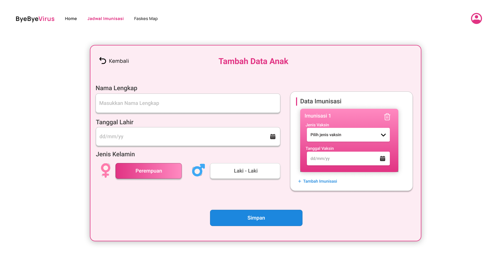
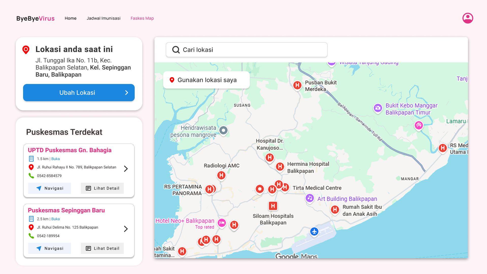

# ☁️ Cloud App - [Bye bye virus]

Bye bye Virus adalah aplikasi yang dirancang untuk memantau dan mengelola imunisasi serta tumbuh kembang anak. Aplikasi ini menyediakan solusi komperehensif yang bertujuan untuk memastikan bahwa setiap anak menerima perlindungan kesehatan yang memadai dan mencapai potensi perkembangannya secara maksimal.

Masalah yang sering dihadapi orang tua terutama yang baru memiliki anak dan sedang bekerja, biasanya sering terlewat jadwal imunisasi dikarenakan tidak adanya informasi atau pengingat secara berkala. Aplikasi ini hadir untuk memudahkan para orang tua (ibu rumah tangga maupun yang sedang bekerja) dalam merencanakan dan menjadwalkan imunisasi anak mereka.

---

## 📊 Project Status ✅

| Component          | Status         | Progress                    |
| ------------------ | -------------- | --------------------------- |
| **Backend Core**   | ✅ COMPLETE    | 100%                        |
| **Database**       | ✅ COMPLETE    | 100%                        |
| **API Endpoints**  | ✅ COMPLETE    | 35+ endpoints               |
| **Authentication** | ✅ COMPLETE    | JWT + bcrypt                |
| **Documentation**  | ✅ COMPLETE    | 5 comprehensive guides      |
| **Frontend**       | 🏗️ IN PROGRESS | 40% (needs API integration) |
| **Testing**        | 🧪 READY       | Setup complete              |
| **Deployment**     | 🚀 READY       | Railway/Render/Docker       |

---
## 📅 Roadmap

| Minggu | Target                 | Status |
| ------ | ---------------------- | ------ |
| 1      | Setup & Hello World    | ✅     |
| 2      | REST API + Database    | ✅     |
| 3      | React Frontend         | ✅     |
| 4      | Full-Stack Integration | ✅     |
| 5-7    | Docker & Compose       | ⬜     |
| 8      | UTS Demo               | ⬜     |
| 9-11   | CI/CD Pipeline         | ⬜     |
| 12-14  | Microservices          | ⬜     |
| 15-16  | Final & UAS            | ⬜     |

---

## 👥 Tim

| Nama                 | NIM      | Peran          |
| -------------------- | -------- | -------------- |
| Ahmad Daffa Alfattah | 10231008 | Lead Backend   |
| Nazwa Amelia Zahra   | 10231068 | Lead Frontend  |
| Cintya Widhi Astuti  | 10231026 | Lead DevOps    |
| Verina Rahma Dinah   | 10231090 | Lead QA & Docs |

## 🛠️ Tech Stack

| Teknologi      | Fungsi           | Keterangan                                                                                                                                   |
| -------------- | ---------------- | -------------------------------------------------------------------------------------------------------------------------------------------- |
| FastAPI        | Backend REST API | Membangun layanan backend berbasis REST API yang menangani logika aplikasi, pengolahan data, dan komunikasi dengan database                  |
| React          | Frontend SPA     | Membangun antarmuka pengguna berbasis Single Page Application yang interaktif, responsif, dan mampu berkomunikasi dengan backend melalui API |
| PostgreSQL     | Database         | Menyimpan data aplikasi secara terstruktur                                                                                                   |
| Docker         | Containerization | Mengemas aplikasi dan seluruh dependensinya ke dalam container sehingga aplikasi bisa berjalan konsisten di lingkungan manapun               |
| GitHub Actions | CI/CD            | Mengotomatiskan proses pengujian, build, dan deployment aplikasi                                                                             |
| Railway/Render | Cloud Deployment | Melakukan deployment aplikasi ke cloud agar backend dan frontend dapat berjalan dan diakses secara online                                    |

## 🏗️ Architecture

```
Frontend (React)
        ↓ HTTP Request
Backend (FastAPI - Python)
        ↓ SQL Query
Database (PostgreSQL)
```

_(Diagram ini akan berkembang setiap minggu)_

## 📁 Struktur File

```
cloud-team-stranger_things/
├── backend/
|   ├── Dockerfile           ← BARU
│   ├── .dockerignore        ← BARU
│   ├── main.py              ← Updated (auth endpoints, CORS fix)
│   ├── auth.py              ← BARU (JWT utilities)
│   ├── database.py
│   ├── models.py            ← Updated (+ User model)
│   ├── schemas.py           ← Updated (+ auth schemas)
│   ├── crud.py              ← Updated (+ user CRUD)
│   ├── requirements.txt     ← Updated (+ jose, passlib, bcrypt)
│   ├── .env                 ← Updated (+ JWT & CORS config)
│   └── .env.example         ← Updated
├── frontend/
│   ├── src/
│   │   ├── App.jsx              ← Updated (auth integration)
│   │   ├── components/
│   │   │   ├── Header.jsx       ← Updated (+ user info, logout)
│   │   │   ├── LoginPage.jsx    ← BARU
│   │   │   ├── SearchBar.jsx
│   │   │   ├── ItemForm.jsx
│   │   │   ├── ItemList.jsx
│   │   │   └── ItemCard.jsx
│   │   └── services/
│   │       └── api.js           ← Updated (+ auth, token mgmt)
│   ├── .env
│   └── .env.example
├── .gitignore
└── README.md
```


## 🚀 Getting Started

### Prasyarat

#### 1. Python 3.10+

Python digunakan untuk menjalankan backend yang dibangun menggunakan FastAPI. Versi minimal 3.10+ diperlukan karena kompatibel dengan dependensi modern FastAPI.
Digunakan untuk:

- Menjalankan server API dengan `uvicorn`
- Mengelola dependensi menggunakan `pip`
- Menjalankan logika backend aplikasi

Tanpa Python, backend tidak dapat dijalankan.

#### 2. Node.js 18+

Node.js digunakan untuk menjalankan frontend berbasis React. Versi minimal 18+ direkomendasikan karena mendukung fitur JavaScript modern dan kompatibel dengan Vite.
Digunakan untuk:

- Menginstall dependencies dengan `npm install`
- Menjalankan development server dengan `npm run dev`
- Mengelola package frontend

Tanpa Node.js, frontend tidak dapat dijalankan.

#### 3. Git

Git digunakan sebagai sistem version control dalam pengembangan proyek. Berfungsi untuk:

- Meng-clone repository
- Mengelola perubahan kode
- Mendukung kolaborasi tim
- Integrasi dengan GitHub dan CI/CD

Walaupun aplikasi tetap bisa dijalankan tanpa Git (jika file sudah tersedia), Git sangat penting dalam proses pengembangan dan deployment.

## 📖  Quick Start

```bash
# 1. Setup Database
psql -U postgres -d bye_virus -f backend/database_schema_postgre.sql

# 2. Install Dependencies
cd backend
pip install -r requirements.txt

# 3. Run Backend
uvicorn main:app --reload

# 4. Open API Documentation
# http://localhost:8000/docs

# 5. Run Frontend (di terminal baru)
cd frontend
npm install
npm run dev
```

Panduan langkah-langkah yang lengkap untuk menjalankan proyek ini dapat dilihat di [Setup Guide](docs/setup-guide.md).

## 🔧Backend

Backend pada aplikasi Perisai Anak / Bye Bye Virus akan dibangun menggunakan FastAPI, yaitu framework Python modern yang dirancang untuk membangun REST API .

**Rencana Logika Backend**
1. Sistem Autentikasi\
Bye Bye Virus menggunakan:

   - JWT (JSON Web Token) untuk autentikasi
   - bcrypt untuk hashing password
   - Role-Based Access Control untuk membatasi akses berdasarkan role:
      - parent
      - health_worker
  
2. Data Schema\
Untuk mendukung kebutuhan aplikasi, data utama yang dikelola meliputi:
    - **Users:** menyimpan data akun orang tua / tenaga kesehatan
    - **Children:** menyimpan profil anak
    - **Vaccine Schedule:** master jadwal imunisasi berdasarkan usia
    - **Immunization Logs:** catatan status imunisasi anak
    - **Growth Records:** data pertumbuhan anak
    - **Reminders:** pengaturan dan riwayat notifikasi
    - **Health Facilities:** data fasilitas kesehatan
  
3. Backend Logic Flow\
Alur kerja backend dirancang untuk menjaga integritas data:

   - FastAPI menerima request dari React Frontend melalui HTTP
   - Sistem melakukan validasi data
   - Backend memproses logika bisnis
   - Backend menghitung dynamic schedule berdasarkan usia anak
   - Data disimpan / diambil dari PostgreSQL
   - Response dikembalikan ke frontend dalam format JSON


## 🎨 Frontend
Frontend aplikasi **Bye Bye Virus** bertugas sebagai antarmuka pengguna (UI/UX) yang berinteraksi langsung dengan backend melalui REST API.

**Manajemen State**\
Frontend menggunakan:
- React Context API untuk autentikasi
- LocalStorage untuk menyimpan JWT
- Protected Route untuk membatasi akses halaman tertentu

**Alur Integrasi Frontend ke Backend**
```
User Action (Form Submit)
        ↓
Axios / Fetch API
        ↓
FastAPI Backend
        ↓
Response JSON
        ↓
Update State React
        ↓
UI Re-render
```
---

## 📦 Modul Aplikasi

### 1. Modul Autentikasi

#### Backend Features

| No | Fitur | Endpoint | Method | Keterangan |
| --- | --- | --- | --- | --- |
| 1 | Registrasi Akun | `/register` | POST | Mendaftarkan akun orang tua |
| 2 | Login | `/login` | POST | Autentikasi dan mendapatkan JWT token |
| 3 | Get Current User | `/me` | GET | Mengambil data user yang sedang login |
| 4 | Role-Based Access | Protected Endpoint | - | Membatasi akses berdasarkan role |

#### Frontend Pages

| No | Halaman | Fungsi |
| --- | --- | --- |
| 1 | Login | Form login + simpan JWT |
| 2 | Register | Form pendaftaran akun |
| 3 | Logout | Hapus token & redirect |

---

### 2. Modul Data Anak

#### Backend Features

| No | Fitur | Method | Deskripsi |
| --- | --- | --- | --- |
| 1 | Tambah Data Anak | POST | Menambahkan data anak baru |
| 2 | Lihat Semua Anak | GET | Menampilkan daftar anak dalam 1 akun |
| 3 | Detail Anak | GET | Menampilkan detail data anak |
| 4 | Update Data Anak | PUT | Memperbarui data anak |
| 5 | Hapus Data Anak | DELETE | Menghapus data anak |

#### Frontend Pages

| No | Fitur | Deskripsi |
| --- | --- | --- |
| 1 | List Anak | Menampilkan semua anak |
| 2 | Tambah Anak | Form input data anak |
| 3 | Edit Anak | Update data anak |
| 4 | Detail Anak | Menampilkan profil anak |

---

### 3. Modul ImuniTrack (Imunisasi)

#### Backend Features

| No | Fitur | Method | Deskripsi |
| --- | --- | --- | --- |
| 1 | Tambah Jadwal Imunisasi | POST | Menambahkan jadwal imunisasi |
| 2 | Lihat Jadwal | GET | Menampilkan jadwal imunisasi |
| 3 | Detail Jadwal | GET | Melihat detail imunisasi |
| 4 | Update Status | PUT | Mengubah status menjadi selesai |
| 5 | Hapus Jadwal | DELETE | Menghapus jadwal imunisasi |

#### Frontend Pages

| No | Fitur | Deskripsi |
| --- | --- | --- |
| 1 | List Jadwal | Daftar imunisasi |
| 2 | Tambah Jadwal | Form penjadwalan |
| 3 | Update Status | Tandai selesai |
| 4 | Detail Jadwal | Informasi lengkap |

---

### 4. Modul Kembang Diary

#### Backend Features

| No | Fitur | Method | Deskripsi |
| --- | --- | --- | --- |
| 1 | Tambah Data Pertumbuhan | POST | Menambahkan data berat / tinggi badan |
| 2 | Lihat Riwayat | GET | Menampilkan riwayat pertumbuhan anak |
| 3 | Update Data | PUT | Memperbarui data pertumbuhan |
| 4 | Hapus Data | DELETE | Menghapus data pertumbuhan |

#### Frontend Pages

| No | Fitur | Deskripsi |
| --- | --- | --- |
| 1 | Input Data | Berat & tinggi badan |
| 2 | Grafik Pertumbuhan | Visualisasi chart |
| 3 | Riwayat Data | Daftar perkembangan |

---

### 5. Modul Smart Reminder

#### Backend Features

| No | Fitur | Method | Deskripsi |
| --- | --- | --- | --- |
| 1 | Notifikasi H-1 | System | Mengirim pengingat sebelum jadwal imunisasi |
| 2 | Aktivasi Reminder | POST | Mengaktifkan atau menonaktifkan notifikasi |
| 3 | Lihat Riwayat Notifikasi | GET | Menampilkan riwayat reminder |

#### Frontend Support

| No | Fitur | Deskripsi |
| --- | --- | --- |
| 1 | Reminder Aktif | Menampilkan status notifikasi |
| 2 | Jadwal Terdekat | Menampilkan imunisasi H-1 |
| 3 | Riwayat Reminder | Menampilkan riwayat notifikasi |

---

### 6. Modul Faskes Map

#### Backend Features

| No | Fitur | Method | Deskripsi |
| --- | --- | --- | --- |
| 1 | Lihat Daftar Faskes | GET | Menampilkan daftar fasilitas kesehatan |
| 2 | Detail Faskes | GET | Menampilkan detail lokasi dan jadwal |
| 3 | Tambah Faskes | POST | Ditambahkan oleh admin / health worker |

#### Frontend Pages

| No | Fitur | Deskripsi |
| --- | --- | --- |
| 1 | Daftar Faskes | List fasilitas kesehatan |
| 2 | Detail Faskes | Jadwal & alamat |
| 3 | Peta Interaktif | Integrasi Google Maps / Leaflet |

---

### 7. Dashboard

| No | Fitur | Deskripsi |
| --- | --- | --- |
| 1 | Ringkasan Anak | Menampilkan jumlah anak |
| 2 | Jadwal Terdekat | Menampilkan imunisasi H-1 |
| 3 | Reminder Aktif | Menampilkan status notifikasi |
| 4 | Artikel Edukasi | Menampilkan artikel terbaru |


## 🗂️ ERD


Berikut adalah detail arsitektur database PostgreSQL yang digunakan oleh aplikasi **Bye Bye Virus** berdasarkan model SQLAlchemy yang digunakan pada backend.

### Tabel: Roles

| Atribut     | Tipe | Keterangan          |
| ----------- | ---- | ------------------- |
| id          | PK   | Primary key         |
| name        | -    | Nama peran pengguna |
| description | -    | Deskripsi peran     |
| created_at  | -    | Waktu dibuat        |

### Tabel: Users

| Atribut         | Tipe | Keterangan                     |
| --------------- | ---- | ------------------------------ |
| id              | PK   | Primary key                    |
| email           | -    | Email pengguna                 |
| name            | -    | Nama pengguna                  |
| hashed_password | -    | Password yang sudah dienkripsi |
| role_id         | FK   | Relasi ke `roles.id`           |
| is_active       | -    | Status aktif pengguna          |
| created_at      | -    | Waktu dibuat                   |

### Tabel: Children

| Atribut         | Tipe | Keterangan           |
| --------------- | ---- | -------------------- |
| id              | PK   | Primary key          |
| parent_id       | FK   | Relasi ke `users.id` |
| name            | -    | Nama anak            |
| birth_date      | -    | Tanggal lahir        |
| gender          | -    | Jenis kelamin        |
| blood_type      | -    | Golongan darah       |
| height_at_birth | -    | Tinggi saat lahir    |
| weight_at_birth | -    | Berat saat lahir     |
| notes           | -    | Catatan              |
| is_active       | -    | Status aktif         |
| created_at      | -    | Waktu dibuat         |
| updated_at      | -    | Waktu diperbarui     |

### Tabel: healthcare_facilities

| Atribut         | Tipe | Keterangan        |
| --------------- | ---- | ----------------- |
| id              | PK   | Primary key       |
| name            | -    | Nama fasilitas    |
| type            | -    | Jenis fasilitas   |
| address         | -    | Alamat            |
| phone           | -    | Nomor telepon     |
| latitude        | -    | Koordinat lintang |
| longitude       | -    | Koordinat bujur   |
| operating_hours | -    | Jam operasional   |
| notes           | -    | Catatan           |
| is_active       | -    | Status aktif      |
| created_at      | -    | Waktu dibuat      |
| updated_at      | -    | Waktu diperbarui  |


### Tabel: Vaccine_types

| Atribut       | Tipe | Keterangan            |
| ------------- | ---- | --------------------- |
| id            | PK   | Primary key           |
| name          | -    | Nama vaksin           |
| description   | -    | Deskripsi             |
| age_month_min | -    | Usia minimum (bulan)  |
| age_month_max | -    | Usia maksimum (bulan) |
| notes         | -    | Catatan               |
| is_active     | -    | Status aktif          |
| created_at    | -    | Waktu dibuat          |

### Tabel: vaccine_schedules

| Atribut     | Tipe | Keterangan                   |
| ----------- | ---- | ---------------------------- |
| id          | PK   | Primary key                  |
| vaccine_id  | FK   | Relasi ke `vaccine_types.id` |
| age_month   | -    | Usia pemberian (bulan)       |
| dose_number | -    | Dosis ke-                    |
| description | -    | Deskripsi                    |
| notes       | -    | Catatan                      |
| is_active   | -    | Status aktif                 |
| created_at  | -    | Waktu dibuat                 |
| updated_at  | -    | Waktu diperbarui             |

### Tabel: immunization_logs

| Atribut              | Tipe | Keterangan                           |
| -------------------- | ---- | ------------------------------------ |
| id                   | PK   | Primary key                          |
| child_id             | FK   | Relasi ke `children.id`              |
| vaccine_id           | FK   | Relasi ke `vaccine_types.id`         |
| schedule_id          | FK   | Relasi ke `vaccine_schedules.id`     |
| facility_id          | FK   | Relasi ke `healthcare_facilities.id` |
| healthcare_worker_id | FK   | Relasi ke `users.id`                 |
| status               | -    | Status imunisasi                     |
| scheduled_date       | -    | Tanggal jadwal                       |
| completion_date      | -    | Tanggal selesai                      |
| notes                | -    | Catatan                              |
| created_at           | -    | Waktu dibuat                         |
| updated_at           | -    | Waktu diperbarui                     |

### Tabel: growth_records

| Atribut            | Tipe | Keterangan              |
| ------------------ | ---- | ----------------------- |
| id                 | PK   | Primary key             |
| child_id           | FK   | Relasi ke `children.id` |
| age_month          | -    | Usia (bulan)            |
| weight             | -    | Berat badan             |
| height             | -    | Tinggi badan            |
| head_circumference | -    | Lingkar kepala          |
| recorded_date      | -    | Tanggal pencatatan      |
| notes              | -    | Catatan                 |
| created_at         | -    | Waktu dibuat            |
| updated_at         | -    | Waktu diperbarui        |

### Tabel: reminders

| Atribut             | Tipe | Keterangan                       |
| ------------------- | ---- | -------------------------------- |
| id                  | PK   | Primary key                      |
| immunization_log_id | FK   | Relasi ke `immunization_logs.id` |
| reminder_type       | -    | Jenis pengingat                  |
| reminder_date       | -    | Tanggal pengingat                |
| is_sent             | -    | Status terkirim                  |
| sent_at             | -    | Waktu dikirim                    |
| status              | -    | Status pengingat                 |
| created_at          | -    | Waktu dibuat                     |

### Tabel: articles

| Atribut      | Tipe | Keterangan           |
| ------------ | ---- | -------------------- |
| id           | PK   | Primary key          |
| title        | -    | Judul artikel        |
| content      | -    | Isi artikel          |
| author_id    | FK   | Relasi ke `users.id` |
| category     | -    | Kategori             |
| is_published | -    | Status publikasi     |
| created_at   | -    | Waktu dibuat         |
| updated_at   | -    | Waktu diperbarui     |
| published_at | -    | Waktu publikasi      |

### Tabel: audit_logs

| Atribut    | Tipe | Keterangan           |
| ---------- | ---- | -------------------- |
| id         | PK   | Primary key          |
| user_id    | FK   | Relasi ke `users.id` |
| action     | -    | Aksi yang dilakukan  |
| table_name | -    | Nama tabel           |
| record_id  | -    | ID data              |
| old_values | -    | Data lama            |
| new_values | -    | Data baru            |
| ip_address | -    | Alamat IP            |
| created_at | -    | Waktu dibuat         |

### Ringkasan Relasi Utama:

| Relasi                                    | Kardinalitas | Penjelasan                                                                           |
| ----------------------------------------- | ------------ | ------------------------------------------------------------------------------------ |
| roles → users                             | 1 : N        | Satu role dapat dimiliki oleh banyak user, tetapi satu user hanya memiliki satu role |
| users → children                          | 1 : N        | Satu user (orang tua) dapat memiliki banyak anak                                     |
| children → growth_records                 | 1 : N        | Satu anak memiliki banyak catatan pertumbuhan                                        |
| children → immunization_logs              | 1 : N        | Satu anak memiliki banyak riwayat imunisasi                                          |
| vaccine_types → vaccine_schedules         | 1 : N        | Satu jenis vaksin memiliki banyak jadwal                                             |
| vaccine_types → immunization_logs         | 1 : N        | Satu jenis vaksin dapat digunakan pada banyak riwayat imunisasi                      |
| vaccine_schedules → immunization_logs     | 1 : N        | Satu jadwal vaksin dapat digunakan pada banyak imunisasi                             |
| healthcare_facilities → immunization_logs | 1 : N        | Satu fasilitas melayani banyak imunisasi                                             |
| users → immunization_logs                 | 1 : N        | Satu user (tenaga kesehatan) dapat menangani banyak imunisasi                        |
| immunization_logs → reminders             | 1 : N        | Satu riwayat imunisasi memiliki banyak pengingat                                     |
| users → articles                          | 1 : N        | Satu user dapat menulis banyak artikel                                               |
| users → audit_logs                        | 1 : N        | Satu user memiliki banyak catatan aktivitas                                          |


## 🔗 API Endpoints

### Health Check

| Method | Endpoint   | Deskripsi       |
|--------|-----------|-----------------|
| GET    | /health   | Cek status API  |

---

### Authentication

| Method | Endpoint | Deskripsi |
| --- | --- | --- |
| POST | `/auth/register` | Registrasi user baru |
| POST | `/auth/login` | Login user dan mendapatkan access token |
| GET | `/auth/me` | Mengambil profil user yang sedang login |

---

### Children

| Method | Endpoint | Deskripsi |
| --- | --- | --- |
| POST | `/children` | Menambahkan profil anak baru |
| GET | `/children` | Mengambil semua data anak milik user |
| GET | `/children/{child_id}` | Mengambil detail anak berdasarkan ID |
| PUT | `/children/{child_id}` | Memperbarui data anak |
| DELETE | `/children/{child_id}` | Menghapus data anak |

---

### Immunization

| Method | Endpoint | Deskripsi |
| --- | --- | --- |
| POST | `/children/{child_id}/immunization` | Menambahkan catatan imunisasi anak |
| GET | `/children/{child_id}/immunization` | Mengambil semua catatan imunisasi anak |
| GET | `/children/{child_id}/immunization/pending` | Mengambil daftar imunisasi anak yang masih pending |
| PUT | `/immunization/{log_id}` | Memperbarui catatan imunisasi |

---

### Growth Records

| Method | Endpoint | Deskripsi |
| --- | --- | --- |
| POST | `/children/{child_id}/growth` | Menambahkan catatan pertumbuhan anak |
| GET | `/children/{child_id}/growth` | Mengambil seluruh riwayat pertumbuhan anak |
| GET | `/children/{child_id}/growth/latest` | Mengambil data pertumbuhan terbaru anak |

---

### Vaccines

| Method | Endpoint | Deskripsi |
| --- | --- | --- |
| GET | `/vaccines` | Mengambil daftar semua vaksin |
| GET | `/vaccines/schedule` | Mengambil jadwal vaksin berdasarkan usia anak (bulan) |

---

### Healthcare Facilities

| Method | Endpoint | Deskripsi |
| --- | --- | --- |
| GET | `/healthcare-facilities` | Mengambil daftar semua fasilitas kesehatan |
| GET | `/healthcare-facilities/type/{facility_type}` | Mengambil fasilitas kesehatan berdasarkan tipe |

---

### Articles

| Method | Endpoint | Deskripsi |
| --- | --- | --- |
| POST | `/articles` | Menambahkan artikel edukasi |
| GET | `/articles` | Mengambil daftar artikel |
| GET | `/articles/category/{category}` | Mengambil artikel berdasarkan kategori |
| GET | `/articles/{article_id}` | Mengambil detail artikel |
| PUT | `/articles/{article_id}` | Memperbarui artikel |
| DELETE | `/articles/{article_id}` | Menghapus artikel |

---

### Team Info

| Method | Endpoint | Deskripsi |
| --- | --- | --- |
| GET | `/team` | Menampilkan informasi tim pengembang |

---

## 📱 Mockup Sistem

- Splash Screen


Pada halaman ini ialah tampilan awala dimana sebelum pengguna login atau regristrasi di arahkan halaman ini  yang menyajikan profil perusahaan secara singkat dan informatif. Di halaman ini, pengguna akan menemukan menu navigasi utama seperti Home, Jadwal Imunisasi, Faskes Map, serta pilihan Sign In dan Sign Up, yang memudahkan akses ke berbagai layanan yang tersedia. Bagian tengah menampilkan tagline "Temukan jadwal imunisasi yang tepat untuk anak Anda" yang memperkuat tujuan sistem dalam membantu orang tua memantau serta mengatur jadwal vaksinasi anak. Dilengkapi dengan deskripsi singkat mengenai fitur lengkap, seperti informasi terkait vaksin, pengingat jadwal, dan rekomendasi layanan kesehatan yang dapat dipercaya, serta tombol aksi "Jadwalkan Sekarang" yang menawarkan pengguna untuk segera memulai. Dengan demikian, halaman splash screen ini tidak hanya berfungsi sebagai pintu masuk ke dalam sistem, tetapi juga memberikan gambaran mengenai identitas, manfaat, serta ajakan untuk bertindak yang khas dari solusi kesehatan digital Bye Bye Virus.

- Daftar Akun


Halaman Daftar Akun ini merupakan tahap pendaftaran pengguna baru dalam sistem Bye Bye Virus. Pengguna diminta mengisi empat kolom: Nama Lengkap, Nama Pengguna, Password (dengan ketentuan minimal 8 karakter), serta Konfirmasi Password untuk memastikan kesesuaian. Di bawah formulir, tersedia tombol Kembali Sekarang yang berfungsi untuk kembali ke halaman sebelumnya. Bagi yang sudah memiliki akun, disediakan tautan "Sudah punya akun?" yang mengarahkan ke halaman masuk. 

- Masuk Akun


Halaman Masuk Akun ini merupakan akses yang digunakan oleh pengguna yang telah memiliki akun untuk memasuki sistem Bye Bye Virus. Ada dua kolom input yang wajib diisi, yaitu Nama Pengguna dengan ketentuan maksimal 8 karakter, serta Password yang memiliki panjang 5 karakter. Setelah kedua kolom tersebut diisi, pengguna dapat mengklik tombol "Masuk" untuk melanjutkan ke halaman utama sistem. Di bawah tombol tersebut terdapat opsi "Atau masuk dengan" yang memungkinkan pengguna untuk memilih metode login alternatif, seperti menggunakan akun media sosial atau email. Bagi pengguna yang belum memiliki akun, tersedia kalimat "Belum punya akun?" yang diikuti oleh tautan "Daftar sekarang" yang mengarah ke halaman pendaftaran. Oleh karena itu, halaman ini dirancang sederhana agar pengguna, khususnya orang tua, dapat dengan mudah mengakses layanan imunisasi tanpa mengalami kesulitan.

- Beranda


Halaman Beranda ini muncul setelah pengguna berhasil masuk ke sistem. Di sini, sistem menyapa pengguna dengan nama, misalnya "Selamat Datang, Andin!" serta kalimat ajakan untuk menjaga kesehatan si kecil bersama Bye Bye Virus. Bagian paling atas menampilkan Pengingat penting, yaitu imunisasi BCG untuk anak bernama Dina yang akan jatuh tempo dalam 3 hari lagi. Selanjutnya ada bagian Ringkasan Imunisasi yang dibagi menjadi tiga kategori: "Selesai" (dimaksudkan sebagai imunisasi yang sudah berjalan) dengan angka 7 dari total 12 imunisasi, "Mendatang" sebanyak 3 imunisasi dalam 30 hari ke depan, serta "Belum terjadwal" sebanyak 2 imunisasi yang perlu segera dijadwalkan.

Di bawah ringkasan, terdapat daftar Jadwal Imunisasi Terdekat yang semuanya jatuh pada tanggal 6 April 2026 dengan keterangan "3 hari lagi". Nama vaksin yang tercantum antara lain BCG, POLIO 2, Hepatitis B, DPT 1, menunjukkan jadwal yang akan datang. Bagian paling bawah adalah EduHealth yang berisi tiga artikel singkat seputar imunisasi, yaitu tentang kelengkapan jadwal imunisasi, tips agar anak tidak takut saat imunisasi, serta penjelasan mengapa imunisasi penting untuk kesehatan anak. Dengan demikian, halaman beranda ini menjadi pusat kendali bagi orang tua untuk memantau jadwal, melihat ringkasan, serta membaca informasi edukatif sekaligus.

- Jadwal Imunisasi


Halaman ini merupakan bagian dari fitur jadwal imunisasi yang menampilkan data anak dan riwayat imunisasi masing-masing. Di bagian atas, terdapat Daftar anak yang berisi dua nama, yaitu Cintya Widhi Astuti dan Ahmad Daffa Alfattah, serta tombol + Tambah anak untuk menambahkan anak baru ke dalam sistem. Ketika salah satu anak dipilih, misalnya Cintya Widhi Astuti, maka di sebelah kanan akan muncul Profil Data Anak yang mencakup umur (2 bulan), jenis kelamin (perempuan), tanggal lahir (15 November 2024), serta daftar imunisasi sebelumnya yaitu Hepatitis B dan DPT. Di bawah profil, terdapat data Tinggi Terkini sebesar 105 cm dengan kenaikan +5 cm bulan ini, serta Berat Terkini sebesar 11,5 kg dengan kenaikan +0,5 kg bulan ini. Dengan demikian, halaman ini tidak hanya membantu orang tua melihat jadwal imunisasi yang akan datang, tetapi juga memantau pertumbuhan anak secara berkala dalam satu tampilan yang ringkas.

- Data Anak



- Faskes Map



## 📋 Hasil Pengujian
- [Modul 2: dokumentasi hasil testing semua endpoint via Swagger](docs/api-test-results.md)
- [Modul 3: dokumentasi UI testing](docs/ui-test-results.md)
- [Modul 4: dokumentasi Auth testing](docs/auth-test-results.md)
- [Modul 5: dokumentasi perbandingan ukuran image](docs/image-comparison.md)
