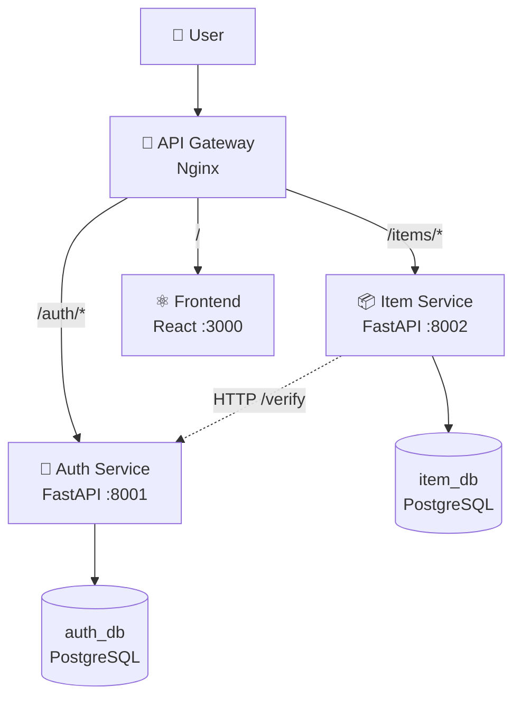
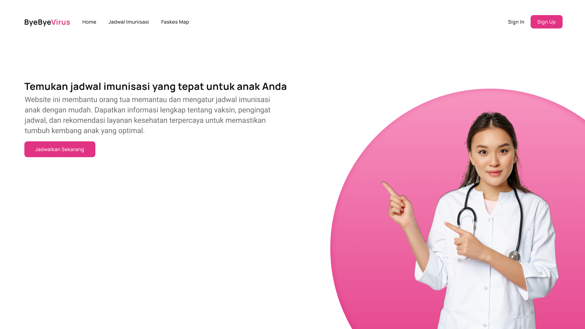
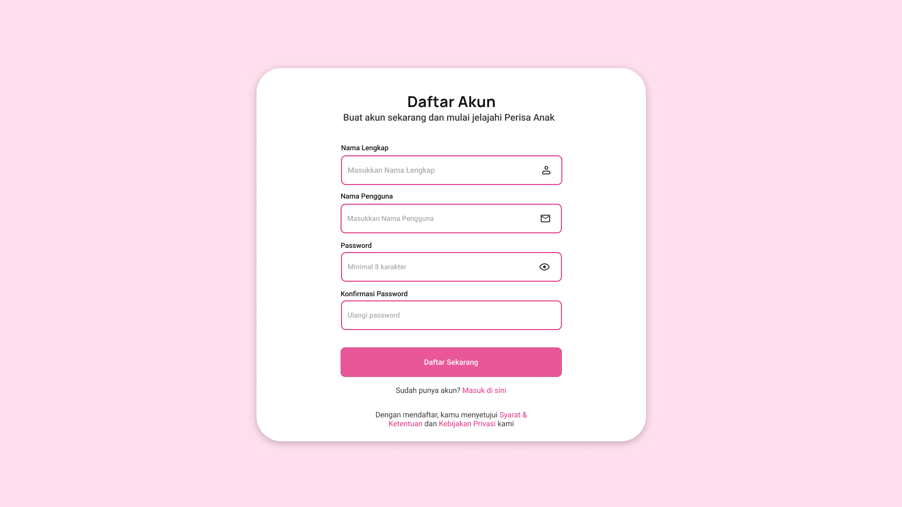
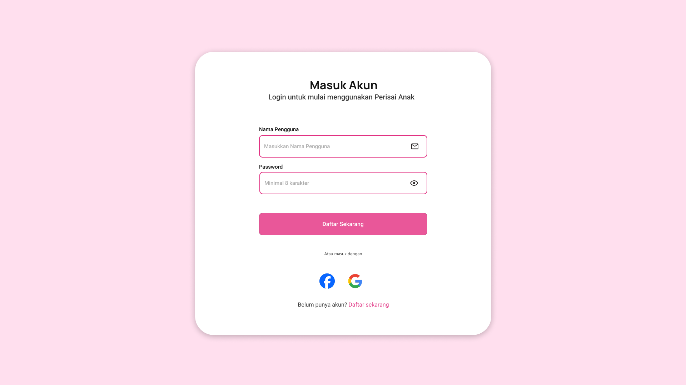
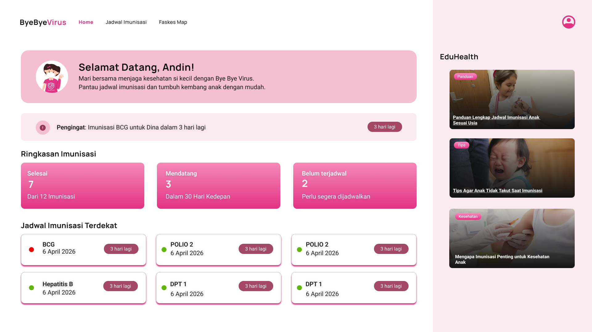
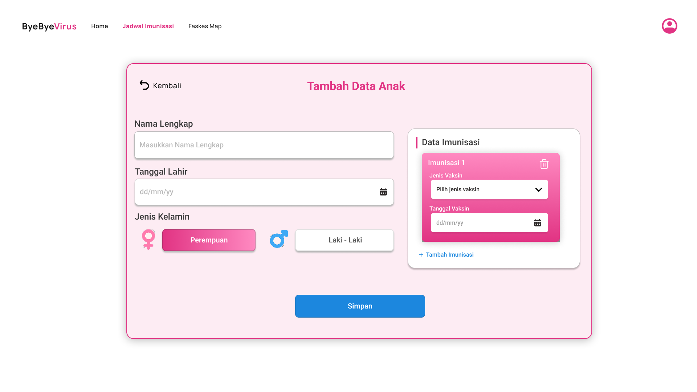
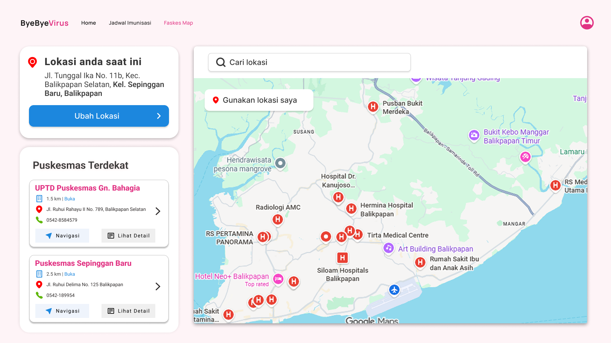

# ☁️ Cloud App — Kelompok Stranger Things

> Aplikasi cloud-native untuk manajemen inventory, dibangun dengan arsitektur
> microservices sebagai proyek mata kuliah Komputasi Awan — Institut Teknologi
> Kalimantan.


Bye bye Virus adalah aplikasi yang dirancang untuk memantau dan mengelola imunisasi orang tua serta tumbuh kembang anak. Aplikasi ini menyediakan solusi komperehensif yang bertujuan untuk memastikan bahwa setiap anak menerima perlindungan kesehatan yang memadai dan mencapai potensi perkembangannya secara maksimal.

Masalah yang sering dihadapi orang tua terutama yang baru memiliki anak dan sedang bekerja, biasanya sering terlewat jadwal imunisasi dikarenakan tidak adanya informasi atau pengingat secara berkala. Aplikasi ini hadir untuk memudahkan para orang tua (ibu rumah tangga maupun yang sedang bekerja) dalam merencanakan dan menjadwalkan imunisasi anak mereka.

---
## 📅 Roadmap

| Minggu | Target                 | Status |
| ------ | ---------------------- | ------ |
| 1      | Setup & Hello World    | ✅     |
| 2      | REST API + Database    | ✅     |
| 3      | React Frontend         | ✅     |
| 4      | Full-Stack Integration + Auth | ✅     |
| 5-7    | Docker & Compose       | ✅     |
| 8      | UTS Demo  (Milestone 1)| ✅     |
| 9-11   | CI/CD Pipeline         | ✅     |
| 12-14  | Microservices          | ✅     |
| 15     | Final Polish & Securit | ⬜     |
| 12-14  | Microservices          | ✅     |
---

## 👥 Tim

| Nama                 | NIM      | Peran          |
| -------------------- | -------- | -------------- |
| Ahmad Daffa Alfattah | 10231008 | Lead Backend   |
| Nazwa Amelia Zahra   | 10231068 | Lead Frontend  |
| Cintya Widhi Astuti  | 10231026 | Lead DevOps    |
| Verina Rahma Dinah   | 10231090 | Lead QA & Docs |

## 🛠️ Tech Stack

| Teknologi      | Fungsi           | Keterangan                                                                                                                                   |
| -------------- | ---------------- | -------------------------------------------------------------------------------------------------------------------------------------------- |
| FastAPI        | Backend REST API | Membangun layanan backend berbasis REST API yang menangani logika aplikasi, pengolahan data, dan komunikasi dengan database                  |
| React          | Frontend SPA     | Membangun antarmuka pengguna berbasis Single Page Application yang interaktif, responsif, dan mampu berkomunikasi dengan backend melalui API |
| PostgreSQL     | Database         | Menyimpan data aplikasi secara terstruktur                                                                                                   |
| Docker         | Containerization | Mengemas aplikasi dan seluruh dependensinya ke dalam container sehingga aplikasi bisa berjalan konsisten di lingkungan manapun               |
| GitHub Actions | CI/CD            | Mengotomatiskan proses pengujian, build, dan deployment aplikasi                                                                             |
| Railway/Render | Cloud Deployment | Melakukan deployment aplikasi ke cloud agar backend dan frontend dapat berjalan dan diakses secara online                                    |


## 🏗️ Architecture


```mermaid
flowchart TD
    USER["👤 User"] --> GW["🚪 API Gateway<br/>Nginx"]
    GW -->|"/auth/*"| AUTH["🔐 Auth Service<br/>FastAPI :8001"]
    GW -->|"/items/*"| ITEM["📦 Item Service<br/>FastAPI :8002"]
    GW -->|"/"| FE["⚛️ Frontend<br/>React :3000"]
    AUTH --> ADB[("auth_db<br/>PostgreSQL")]
    ITEM --> IDB[("item_db<br/>PostgreSQL")]
    ITEM -.->|"HTTP /verify"| AUTH
```

### Architecture Evolution

| Phase | Weeks | Architecture |
|-------|-------|-------------|
| Foundation | 1-4 | Monolith (FastAPI + React + PostgreSQL) |
| Containerization | 5-7 | Docker Compose (3 containers) |
| CI/CD | 9-11 | GitHub Actions + Railway deployment |
| Microservices | 12-14 | 2 services + gateway + monitoring |
| Final | 15-16 | Security hardened + production ready |

## 🛠️ Tech Stack

| Layer | Technology | Purpose |
|-------|-----------|---------|
| Frontend | React + Vite | Single Page Application |
| Backend | FastAPI (Python) | REST API microservices |
| Database | PostgreSQL 16 | Relational database (per service) |
| Gateway | Nginx | Reverse proxy + rate limiting |
| Container | Docker + Docker Compose | Containerization |
| CI/CD | GitHub Actions | Automated test + deploy |
| Cloud | Railway | PaaS deployment |
| Monitoring | Custom metrics + dashboard | Observability |

## 🚀 Quick Start

### Prerequisites
- Docker & Docker Compose
- Git

### Run Locally

```bash
# Clone repository
git clone https://github.com/aidilsaputrakirsan-classroom/cc-kelompok-stranger_things.git
cd cc-kelompok-stranger_things

# Copy environment file
cp .env.example .env
# Edit .env with your values

# Start all services
docker compose up -d

# Verify
docker compose ps
curl http://localhost/health
```

Open http://localhost in your browser.

### Run Without Docker

```bash
# Backend (Auth Service)
cd services/auth-service
pip install -r requirements.txt
uvicorn main:app --reload --port 8001

# Backend (Item Service)  
cd services/item-service
pip install -r requirements.txt
uvicorn main:app --reload --port 8002

# Frontend
cd frontend
npm install
npm run dev
```

## 📡 API Documentation

### Auth Service (port 8001)

| Method | Endpoint | Description | Auth |
|--------|----------|-------------|------|
| POST | `/register` | Register user baru | ❌ |
| POST | `/login` | Login, return JWT token | ❌ |
| GET | `/verify` | Verify JWT token (internal) | ✅ |
| GET | `/health` | Health check | ❌ |
| GET | `/metrics` | Service metrics | ❌ |

### Item Service (port 8002)

| Method | Endpoint | Description | Auth |
|--------|----------|-------------|------|
| GET | `/items` | List items (with search) | ✅ |
| POST | `/items` | Create item | ✅ |
| GET | `/items/{id}` | Get item by ID | ✅ |
| PUT | `/items/{id}` | Update item | ✅ |
| DELETE | `/items/{id}` | Delete item | ✅ |
| GET | `/items/stats` | Item statistics | ✅ |
| GET | `/health` | Health check | ❌ |
| GET | `/metrics` | Service metrics | ❌ |

### Via Gateway (port 80)

All requests go through the gateway with prefix:
- Auth: `http://localhost/auth/...`
- Items: `http://localhost/items/...`
- Status: `http://localhost/status`

## 🔐 Security

- JWT authentication with expiry
- bcrypt password hashing
- Rate limiting (Nginx): 5 req/s auth, 20 req/s API
- Input validation (Pydantic)
- CORS configured per environment
- Secrets via environment variables (never hardcoded)
- Database per service (no shared DB)

## 📊 Monitoring

- **Structured Logging**: JSON format with correlation ID
- **Metrics**: `/metrics` endpoint per service (request count, error rate, latency p50/p95/p99)
- **Health Dashboard**: `/status` page with auto-refresh
- **Circuit Breaker**: Item Service → Auth Service with retry + backoff

## 👥 Tim

| Nama | NIM | Peran | Kontribusi Utama |
|------|-----|-------|-----------------|
| [Nama] | [NIM] | Lead Backend | Auth Service, Item Service, API design |
| [Nama] | [NIM] | Lead Frontend | React UI, Status Page, UX |
| [Nama] | [NIM] | Lead DevOps | Docker, Nginx Gateway, Railway deploy |
| [Nama] | [NIM] | Lead QA & Docs | Testing, CI pipeline, documentation |

## 📄 Documentation

- [Architecture Guide](docs/architecture.md)
- [Deployment Guide](docs/deployment-guide.md)
- [Operations Guide](docs/operations-guide.md)
- [API Contract](docs/api-contract.md)
- [Release Notes](docs/release-notes-m3.md)

## 📅 Roadmap

| Week | Target | Status |
|------|--------|--------|
| 1 | Setup & Hello World | ✅ |
| 2 | REST API + Database | ✅ |
| 3 | React Frontend | ✅ |
| 4 | Full-Stack Integration + Auth | ✅ |
| 5-7 | Docker & Compose | ✅ |
| 8 | UTS Demo (Milestone 1) | ✅ |
| 9-11 | CI/CD & Cloud Deployment | ✅ |
| 12-14 | Microservices & Monitoring | ✅ |
| 15 | Final Polish & Security | ✅ |
| 16 | UAS Demo (Milestone 3) | ⬜ |

## 🐳 Docker Compose Commands

Berikut perintah dasar Docker Compose yang digunakan:

| Command | Keterangan |
|---------|------------|
| `docker compose up` | Menjalankan semua service |
| `docker compose up -d` | Menjalankan di background (detached) |
| `docker compose down` | Menghentikan dan menghapus container |
| `docker compose logs` | Menampilkan log semua service |
| `docker compose ps` | Menampilkan status container |
| `docker compose up -d --build` | Build ulang image lalu menjalankan service |


## 📦 Modul Aplikasi

### 1. Modul Autentikasi

#### Backend Features

| No | Fitur | Endpoint | Method | Keterangan |
| --- | --- | --- | --- | --- |
| 1 | Registrasi Akun | `/register` | POST | Mendaftarkan akun orang tua |
| 2 | Login | `/login` | POST | Autentikasi dan mendapatkan JWT token |
| 3 | Get Current User | `/me` | GET | Mengambil data user yang sedang login |
| 4 | Role-Based Access | Protected Endpoint | - | Membatasi akses berdasarkan role |

#### Frontend Pages

| No | Halaman | Fungsi |
| --- | --- | --- |
| 1 | Login | Form login + simpan JWT |
| 2 | Register | Form pendaftaran akun |
| 3 | Logout | Hapus token & redirect |

---

### 2. Modul Data Anak

#### Backend Features

| No | Fitur | Method | Deskripsi |
| --- | --- | --- | --- |
| 1 | Tambah Data Anak | POST | Menambahkan data anak baru |
| 2 | Lihat Semua Anak | GET | Menampilkan daftar anak dalam 1 akun |
| 3 | Detail Anak | GET | Menampilkan detail data anak |
| 4 | Update Data Anak | PUT | Memperbarui data anak |
| 5 | Hapus Data Anak | DELETE | Menghapus data anak |

#### Frontend Pages

| No | Fitur | Deskripsi |
| --- | --- | --- |
| 1 | List Anak | Menampilkan semua anak |
| 2 | Tambah Anak | Form input data anak |
| 3 | Edit Anak | Update data anak |
| 4 | Detail Anak | Menampilkan profil anak |

---

### 3. Modul ImuniTrack (Imunisasi)

#### Backend Features

| No | Fitur | Method | Deskripsi |
| --- | --- | --- | --- |
| 1 | Tambah Jadwal Imunisasi | POST | Menambahkan jadwal imunisasi |
| 2 | Lihat Jadwal | GET | Menampilkan jadwal imunisasi |
| 3 | Detail Jadwal | GET | Melihat detail imunisasi |
| 4 | Update Status | PUT | Mengubah status menjadi selesai |
| 5 | Hapus Jadwal | DELETE | Menghapus jadwal imunisasi |

#### Frontend Pages

| No | Fitur | Deskripsi |
| --- | --- | --- |
| 1 | List Jadwal | Daftar imunisasi |
| 2 | Tambah Jadwal | Form penjadwalan |
| 3 | Update Status | Tandai selesai |
| 4 | Detail Jadwal | Informasi lengkap |

---

### 4. Modul Kembang Diary

#### Backend Features

| No | Fitur | Method | Deskripsi |
| --- | --- | --- | --- |
| 1 | Tambah Data Pertumbuhan | POST | Menambahkan data berat / tinggi badan |
| 2 | Lihat Riwayat | GET | Menampilkan riwayat pertumbuhan anak |
| 3 | Update Data | PUT | Memperbarui data pertumbuhan |
| 4 | Hapus Data | DELETE | Menghapus data pertumbuhan |

#### Frontend Pages

| No | Fitur | Deskripsi |
| --- | --- | --- |
| 1 | Input Data | Berat & tinggi badan |
| 2 | Grafik Pertumbuhan | Visualisasi chart |
| 3 | Riwayat Data | Daftar perkembangan |

---

### 5. Modul Smart Reminder

#### Backend Features

| No | Fitur | Method | Deskripsi |
| --- | --- | --- | --- |
| 1 | Notifikasi H-1 | System | Mengirim pengingat sebelum jadwal imunisasi |
| 2 | Aktivasi Reminder | POST | Mengaktifkan atau menonaktifkan notifikasi |
| 3 | Lihat Riwayat Notifikasi | GET | Menampilkan riwayat reminder |

#### Frontend Support

| No | Fitur | Deskripsi |
| --- | --- | --- |
| 1 | Reminder Aktif | Menampilkan status notifikasi |
| 2 | Jadwal Terdekat | Menampilkan imunisasi H-1 |
| 3 | Riwayat Reminder | Menampilkan riwayat notifikasi |

---

### 6. Modul Faskes Map

#### Backend Features

| No | Fitur | Method | Deskripsi |
| --- | --- | --- | --- |
| 1 | Lihat Daftar Faskes | GET | Menampilkan daftar fasilitas kesehatan |
| 2 | Detail Faskes | GET | Menampilkan detail lokasi dan jadwal |
| 3 | Tambah Faskes | POST | Ditambahkan oleh admin / health worker |

#### Frontend Pages

| No | Fitur | Deskripsi |
| --- | --- | --- |
| 1 | Daftar Faskes | List fasilitas kesehatan |
| 2 | Detail Faskes | Jadwal & alamat |
| 3 | Peta Interaktif | Integrasi Google Maps / Leaflet |

---

### 7. Dashboard

| No | Fitur | Deskripsi |
| --- | --- | --- |
| 1 | Ringkasan Anak | Menampilkan jumlah anak |
| 2 | Jadwal Terdekat | Menampilkan imunisasi H-1 |
| 3 | Reminder Aktif | Menampilkan status notifikasi |
| 4 | Artikel Edukasi | Menampilkan artikel terbaru |


## 🔗 API Endpoints

### Health Check

| Method | Endpoint   | Deskripsi       |
|--------|-----------|-----------------|
| GET    | /health   | Cek status API  |

---

### Authentication

| Method | Endpoint | Deskripsi |
| --- | --- | --- |
| POST | `/auth/register` | Registrasi user baru |
| POST | `/auth/login` | Login user dan mendapatkan access token |
| GET | `/auth/me` | Mengambil profil user yang sedang login |

---

### Children

| Method | Endpoint | Deskripsi |
| --- | --- | --- |
| POST | `/children` | Menambahkan profil anak baru |
| GET | `/children` | Mengambil semua data anak milik user |
| GET | `/children/{child_id}` | Mengambil detail anak berdasarkan ID |
| PUT | `/children/{child_id}` | Memperbarui data anak |
| DELETE | `/children/{child_id}` | Menghapus data anak |

---

### Immunization

| Method | Endpoint | Deskripsi |
| --- | --- | --- |
| POST | `/children/{child_id}/immunization` | Menambahkan catatan imunisasi anak |
| GET | `/children/{child_id}/immunization` | Mengambil semua catatan imunisasi anak |
| GET | `/children/{child_id}/immunization/pending` | Mengambil daftar imunisasi anak yang masih pending |
| PUT | `/immunization/{log_id}` | Memperbarui catatan imunisasi |

---

### Growth Records

| Method | Endpoint | Deskripsi |
| --- | --- | --- |
| POST | `/children/{child_id}/growth` | Menambahkan catatan pertumbuhan anak |
| GET | `/children/{child_id}/growth` | Mengambil seluruh riwayat pertumbuhan anak |
| GET | `/children/{child_id}/growth/latest` | Mengambil data pertumbuhan terbaru anak |

---

### Vaccines

| Method | Endpoint | Deskripsi |
| --- | --- | --- |
| GET | `/vaccines` | Mengambil daftar semua vaksin |
| GET | `/vaccines/schedule` | Mengambil jadwal vaksin berdasarkan usia anak (bulan) |

---

### Healthcare Facilities

| Method | Endpoint | Deskripsi |
| --- | --- | --- |
| GET | `/healthcare-facilities` | Mengambil daftar semua fasilitas kesehatan |
| GET | `/healthcare-facilities/type/{facility_type}` | Mengambil fasilitas kesehatan berdasarkan tipe |

---

### Articles

| Method | Endpoint | Deskripsi |
| --- | --- | --- |
| POST | `/articles` | Menambahkan artikel edukasi |
| GET | `/articles` | Mengambil daftar artikel |
| GET | `/articles/category/{category}` | Mengambil artikel berdasarkan kategori |
| GET | `/articles/{article_id}` | Mengambil detail artikel |
| PUT | `/articles/{article_id}` | Memperbarui artikel |
| DELETE | `/articles/{article_id}` | Menghapus artikel |

---

### Team Info

| Method | Endpoint | Deskripsi |
| --- | --- | --- |
| GET | `/team` | Menampilkan informasi tim pengembang |

---

## 📱 Mockup Sistem

### Splash Screen



Pada halaman ini ialah tampilan awala dimana sebelum pengguna login atau regristrasi di arahkan halaman ini  yang menyajikan profil perusahaan secara singkat dan informatif. Di halaman ini, pengguna akan menemukan menu navigasi utama seperti Home, Jadwal Imunisasi, Faskes Map, serta pilihan Sign In dan Sign Up, yang memudahkan akses ke berbagai layanan yang tersedia. Bagian tengah menampilkan tagline "Temukan jadwal imunisasi yang tepat untuk anak Anda" yang memperkuat tujuan sistem dalam membantu orang tua memantau serta mengatur jadwal vaksinasi anak. Dilengkapi dengan deskripsi singkat mengenai fitur lengkap, seperti informasi terkait vaksin, pengingat jadwal, dan rekomendasi layanan kesehatan yang dapat dipercaya, serta tombol aksi "Jadwalkan Sekarang" yang menawarkan pengguna untuk segera memulai. Dengan demikian, halaman splash screen ini tidak hanya berfungsi sebagai pintu masuk ke dalam sistem, tetapi juga memberikan gambaran mengenai identitas, manfaat, serta ajakan untuk bertindak yang khas dari solusi kesehatan digital Bye Bye Virus.

### Daftar Akun



Halaman Daftar Akun ini merupakan tahap pendaftaran pengguna baru dalam sistem Bye Bye Virus. Pengguna diminta mengisi empat kolom: Nama Lengkap, Nama Pengguna, Password (dengan ketentuan minimal 8 karakter), serta Konfirmasi Password untuk memastikan kesesuaian. Di bawah formulir, tersedia tombol Kembali Sekarang yang berfungsi untuk kembali ke halaman sebelumnya. Bagi yang sudah memiliki akun, disediakan tautan "Sudah punya akun?" yang mengarahkan ke halaman masuk. 

### Masuk Akun



Halaman Masuk Akun ini merupakan akses yang digunakan oleh pengguna yang telah memiliki akun untuk memasuki sistem Bye Bye Virus. Ada dua kolom input yang wajib diisi, yaitu Nama Pengguna dengan ketentuan maksimal 8 karakter, serta Password yang memiliki panjang 5 karakter. Setelah kedua kolom tersebut diisi, pengguna dapat mengklik tombol "Masuk" untuk melanjutkan ke halaman utama sistem. Di bawah tombol tersebut terdapat opsi "Atau masuk dengan" yang memungkinkan pengguna untuk memilih metode login alternatif, seperti menggunakan akun media sosial atau email. Bagi pengguna yang belum memiliki akun, tersedia kalimat "Belum punya akun?" yang diikuti oleh tautan "Daftar sekarang" yang mengarah ke halaman pendaftaran. Oleh karena itu, halaman ini dirancang sederhana agar pengguna, khususnya orang tua, dapat dengan mudah mengakses layanan imunisasi tanpa mengalami kesulitan.

### Beranda



Halaman Beranda ini muncul setelah pengguna berhasil masuk ke sistem. Di sini, sistem menyapa pengguna dengan nama, misalnya "Selamat Datang, Andin!" serta kalimat ajakan untuk menjaga kesehatan si kecil bersama Bye Bye Virus. Bagian paling atas menampilkan Pengingat penting, yaitu imunisasi BCG untuk anak bernama Dina yang akan jatuh tempo dalam 3 hari lagi. Selanjutnya ada bagian Ringkasan Imunisasi yang dibagi menjadi tiga kategori: "Selesai" (dimaksudkan sebagai imunisasi yang sudah berjalan) dengan angka 7 dari total 12 imunisasi, "Mendatang" sebanyak 3 imunisasi dalam 30 hari ke depan, serta "Belum terjadwal" sebanyak 2 imunisasi yang perlu segera dijadwalkan.

Di bawah ringkasan, terdapat daftar Jadwal Imunisasi Terdekat yang semuanya jatuh pada tanggal 6 April 2026 dengan keterangan "3 hari lagi". Nama vaksin yang tercantum antara lain BCG, POLIO 2, Hepatitis B, DPT 1, menunjukkan jadwal yang akan datang. Bagian paling bawah adalah EduHealth yang berisi tiga artikel singkat seputar imunisasi, yaitu tentang kelengkapan jadwal imunisasi, tips agar anak tidak takut saat imunisasi, serta penjelasan mengapa imunisasi penting untuk kesehatan anak. Dengan demikian, halaman beranda ini menjadi pusat kendali bagi orang tua untuk memantau jadwal, melihat ringkasan, serta membaca informasi edukatif sekaligus.

### Jadwal Imunisasi


Halaman ini merupakan bagian dari fitur jadwal imunisasi yang menampilkan data anak dan riwayat imunisasi masing-masing. Di bagian atas, terdapat Daftar anak yang berisi dua nama, yaitu Cintya Widhi Astuti dan Ahmad Daffa Alfattah, serta tombol + Tambah anak untuk menambahkan anak baru ke dalam sistem. Ketika salah satu anak dipilih, misalnya Cintya Widhi Astuti, maka di sebelah kanan akan muncul Profil Data Anak yang mencakup umur (2 bulan), jenis kelamin (perempuan), tanggal lahir (15 November 2024), serta daftar imunisasi sebelumnya yaitu Hepatitis B dan DPT. Di bawah profil, terdapat data Tinggi Terkini sebesar 105 cm dengan kenaikan +5 cm bulan ini, serta Berat Terkini sebesar 11,5 kg dengan kenaikan +0,5 kg bulan ini. Dengan demikian, halaman ini tidak hanya membantu orang tua melihat jadwal imunisasi yang akan datang, tetapi juga memantau pertumbuhan anak secara berkala dalam satu tampilan yang ringkas.

### Data Anak


Halaman ini menampilkan fitur Tambah Data Anak pada aplikasi ByeByeVirus yang digunakan untuk memasukkan data anak beserta informasi imunisasinya. Pada bagian atas terdapat navigation bar untuk memudahkan pengguna berpindah halaman, serta tombol Kembali untuk kembali ke halaman sebelumnya. Form utama terdiri dari input nama lengkap, tanggal lahir, dan jenis kelamin, sehingga data identitas anak dapat dicatat secara lengkap. Di sisi kanan terdapat bagian Data Imunisasi yang memuat pilihan jenis vaksin dan tanggal vaksin, serta opsi untuk menambah data imunisasi lain jika diperlukan.

### Faskes Map


Halaman ini menampilkan fitur Faskes Map pada aplikasi ByeByeVirus yang digunakan untuk membantu pengguna menemukan fasilitas kesehatan terdekat berdasarkan lokasi saat ini. Di sisi kiri terdapat informasi lokasi pengguna dan daftar puskesmas terdekat yang dilengkapi alamat, jarak, serta tombol navigasi dan detail. Di sisi kanan terdapat peta digital yang menampilkan persebaran fasilitas kesehatan sehingga pengguna dapat melihat lokasi layanan imunisasi secara lebih jelas. Secara keseluruhan, halaman ini dirancang untuk memudahkan pengguna dalam mencari fasilitas kesehatan terdekat dengan cepat, praktis, dan informatif.

---

##  👨‍💻  Developer Workflow

Mulai dari modul 9 ini, kita menggunakan **Github Flow**. Setiap anggota tim wajib menjalankan pengecekan lokal menggunakan 'Makefile' sebelum melakukan push kode ke branch fitur.

### Perintah Makefile

Gunakan perintah berikut di terminal:

*   `make lint` : Menjalankan linter (flake8) untuk mengecek kerapian dan standar penulisan kode di backend.
*   `make test` : Menjalankan unit testing (saat ini masih berupa placeholder).
*   `make pr-check` : **Wajib dijalankan sebelum push!** Perintah ini akan membangun ulang (build) Docker container, lalu menjalankan linting dan testing secara otomatis.

### Cara Berkontribusi
1. Ambil update terbaru dari main: `git checkout main && git pull origin main`.
2. Buat branch baru: `git checkout -b tipe/nama-fitur`.
3. Lakukan perubahan kode.
4. **Verifikasi kode** dengan menjalankan `make pr-check`.
5. Jika berhasil (muncul ✅), lakukan commit dan push.
6. Buat Pull Request di GitHub dan minta review dari teman tim.

## 🌐 Live Demo

| Service | URL |
|---------|-----|
| Frontend | [https://cc-kelompok-strangerthings.akhzafachrozy.my.id](https://cc-kelompok-strangerthings.akhzafachrozy.my.id) |
| Backend API | |
| API Docs (Swagger) | |

## 🔄 CI/CD

Pipeline otomatis berjalan saat push ke main:
1. ✅ Test backend (pytest)
2. ✅ Test frontend (Vitest)
3. ✅ Build Docker images
4. 🚀 Deploy ke Railway
---
## 📋 Dokumentasi
- [Dokumentasi hasil testing semua endpoint via Swagger](docs/api-test-results.md)
- [Dokumentasi UI testing](docs/ui-test-results.md)
- [Dokumentasi Auth testing](docs/auth-test-results.md)
- [Docker Cheatsheet](docs/docker-cheatsheet.md)
- [Setup Guide](docs/setup-guide.md)
- [Testing Guide](docs/testing-guide.md)
- [Production Test](docs/production-test.md)
- [Git Workflow](docs/git-workflow.md)

