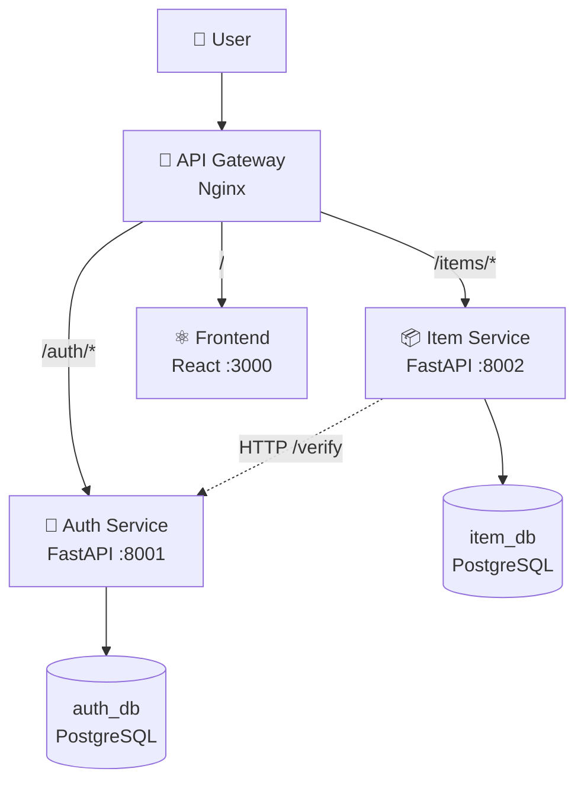

# ☁️ Cloud App — Kelompok Stranger Things

> Aplikasi cloud-native untuk manajemen inventory, dibangun dengan arsitektur
> microservices sebagai proyek mata kuliah Komputasi Awan — Institut Teknologi
> Kalimantan.


## 🏗️ Architecture


```mermaid
flowchart TD
    USER["👤 User"] --> GW["🚪 API Gateway<br/>Nginx"]
    GW -->|"/auth/*"| AUTH["🔐 Auth Service<br/>FastAPI :8001"]
    GW -->|"/items/*"| ITEM["📦 Item Service<br/>FastAPI :8002"]
    GW -->|"/"| FE["⚛️ Frontend<br/>React :3000"]
    AUTH --> ADB[("auth_db<br/>PostgreSQL")]
    ITEM --> IDB[("item_db<br/>PostgreSQL")]
    ITEM -.->|"HTTP /verify"| AUTH
```

### Architecture Evolution

| Phase | Weeks | Architecture |
|-------|-------|-------------|
| Foundation | 1-4 | Monolith (FastAPI + React + PostgreSQL) |
| Containerization | 5-7 | Docker Compose (3 containers) |
| CI/CD | 9-11 | GitHub Actions + Railway deployment |
| Microservices | 12-14 | 2 services + gateway + monitoring |
| Final | 15-16 | Security hardened + production ready |

## 🛠️ Tech Stack

| Layer | Technology | Purpose |
|-------|-----------|---------|
| Frontend | React + Vite | Single Page Application |
| Backend | FastAPI (Python) | REST API microservices |
| Database | PostgreSQL 16 | Relational database (per service) |
| Gateway | Nginx | Reverse proxy + rate limiting |
| Container | Docker + Docker Compose | Containerization |
| CI/CD | GitHub Actions | Automated test + deploy |
| Cloud | Railway | PaaS deployment |
| Monitoring | Custom metrics + dashboard | Observability |

## 🚀 Quick Start

### Prerequisites
- Docker & Docker Compose
- Git

### Run Locally

```bash
# Clone repository
git clone https://github.com/aidilsaputrakirsan-classroom/cc-kelompok-stranger_things.git
cd cc-kelompok-stranger_things

# Copy environment file
cp .env.example .env
# Edit .env with your values

# Start all services
docker compose up -d

# Verify
docker compose ps
curl http://localhost/health
```

Open http://localhost in your browser.

### Run Without Docker

```bash
# Backend (Auth Service)
cd services/auth-service
pip install -r requirements.txt
uvicorn main:app --reload --port 8001

# Backend (Item Service)  
cd services/item-service
pip install -r requirements.txt
uvicorn main:app --reload --port 8002

# Frontend
cd frontend
npm install
npm run dev
```

## 📡 API Documentation

### Auth Service (port 8001)

| Method | Endpoint | Description | Auth |
|--------|----------|-------------|------|
| POST | `/register` | Register user baru | ❌ |
| POST | `/login` | Login, return JWT token | ❌ |
| GET | `/verify` | Verify JWT token (internal) | ✅ |
| GET | `/health` | Health check | ❌ |
| GET | `/metrics` | Service metrics | ❌ |

### Item Service (port 8002)

| Method | Endpoint | Description | Auth |
|--------|----------|-------------|------|
| GET | `/items` | List items (with search) | ✅ |
| POST | `/items` | Create item | ✅ |
| GET | `/items/{id}` | Get item by ID | ✅ |
| PUT | `/items/{id}` | Update item | ✅ |
| DELETE | `/items/{id}` | Delete item | ✅ |
| GET | `/items/stats` | Item statistics | ✅ |
| GET | `/health` | Health check | ❌ |
| GET | `/metrics` | Service metrics | ❌ |

### Via Gateway (port 80)

All requests go through the gateway with prefix:
- Auth: `http://localhost/auth/...`
- Items: `http://localhost/items/...`
- Status: `http://localhost/status`

## 🔐 Security

- JWT authentication with expiry
- bcrypt password hashing
- Rate limiting (Nginx): 5 req/s auth, 20 req/s API
- Input validation (Pydantic)
- CORS configured per environment
- Secrets via environment variables (never hardcoded)
- Database per service (no shared DB)

## 📊 Monitoring

- **Structured Logging**: JSON format with correlation ID
- **Metrics**: `/metrics` endpoint per service (request count, error rate, latency p50/p95/p99)
- **Health Dashboard**: `/status` page with auto-refresh
- **Circuit Breaker**: Item Service → Auth Service with retry + backoff

## 👥 Tim

| Nama | NIM | Peran | Kontribusi Utama |
|------|-----|-------|-----------------|
| [Nama] | [NIM] | Lead Backend | Auth Service, Item Service, API design |
| [Nama] | [NIM] | Lead Frontend | React UI, Status Page, UX |
| [Nama] | [NIM] | Lead DevOps | Docker, Nginx Gateway, Railway deploy |
| [Nama] | [NIM] | Lead QA & Docs | Testing, CI pipeline, documentation |

## 📄 Documentation

- [Architecture Guide](docs/architecture.md)
- [Deployment Guide](docs/deployment-guide.md)
- [Operations Guide](docs/operations-guide.md)
- [API Contract](docs/api-contract.md)
- [Release Notes](docs/release-notes-m3.md)

## 📅 Roadmap

| Week | Target | Status |
|------|--------|--------|
| 1 | Setup & Hello World | ✅ |
| 2 | REST API + Database | ✅ |
| 3 | React Frontend | ✅ |
| 4 | Full-Stack Integration + Auth | ✅ |
| 5-7 | Docker & Compose | ✅ |
| 8 | UTS Demo (Milestone 1) | ✅ |
| 9-11 | CI/CD & Cloud Deployment | ✅ |
| 12-14 | Microservices & Monitoring | ✅ |
| 15 | Final Polish & Security | ✅ |
| 16 | UAS Demo (Milestone 3) | ⬜ |
