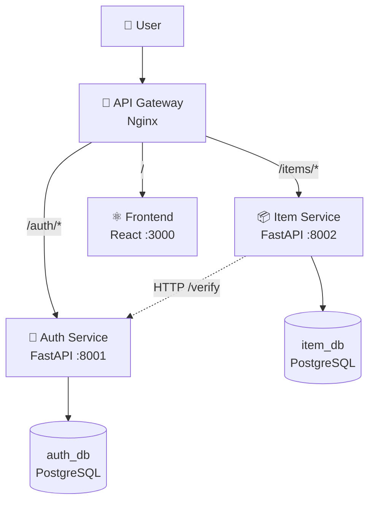
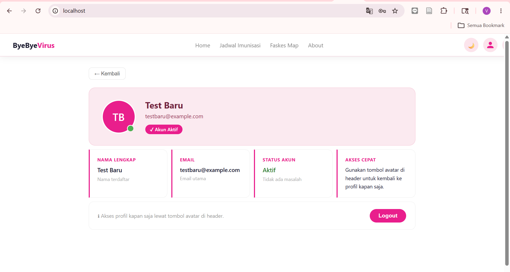
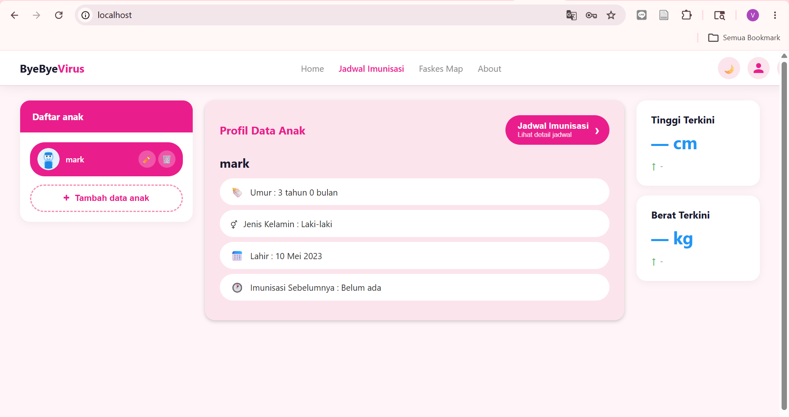

# Microservices Architecture Documentation


## 1. Architecture Diagram



---

## 2. Daftar Services & Ports

| Service       | Port | Database             | Deskripsi                          |
|---------------|------|--------------------|-----------------------------------|
| Auth Service  | 8001 | auth_db (PostgreSQL 16) | Register, login, verify token      |
| Item Service  | 8002 | item_db (PostgreSQL 16) | CRUD item & children, stats        |
| Frontend      | 3000 | -                  | React SPA                          |
| API Gateway   | 80   | -                  | Reverse proxy & routing            |
| Auth DB       | 5434 | -                  | Database Auth Service              |
| Item DB       | 5433 | -                  | Database Item Service              |

---

## 3. API Contract

### Auth Service (`/auth`)

| Method | Endpoint       | Request Body                                         | Response                                                |
|--------|----------------|-----------------------------------------------------|--------------------------------------------------------|
| POST   | /auth/register | `{ "email": "str", "password": "str", "name": "str", "role": "str" }` | 201 `{ "id": int, "email": "str", "name": "str", "role": "str" }` |
| POST   | /auth/login    | `{ "email": "str", "password": "str" }`            | 200 `{ "access_token": "str", "token_type": "bearer", "user": {...} }` |
| GET    | /auth/verify   | Header: Authorization: Bearer `<token>`            | 200 `{ "user_id": int, "email": "str", "name": "str" }` |
| GET    | /auth/health   | -                                                   | 200 `{ "status": "healthy" }`                           |
| GET    | /auth/metrics  | -                                                   | JSON metrics                                           |

### Item Service (`/items` & `/children`)

| Method | Endpoint         | Auth     | Request Body       | Response                                   |
|--------|-----------------|----------|------------------|--------------------------------------------|
| GET    | /items          | Required | -                 | 200 `{ "total": int, "items": [...] }`    |
| POST   | /items          | Required | ItemCreate JSON   | 201 ItemResponse                           |
| GET    | /items/{id}     | Required | -                 | 200 ItemResponse                           |
| PUT    | /items/{id}     | Required | Partial Item JSON | 200 ItemResponse                           |
| DELETE | /items/{id}     | Required | -                 | 204 No content                             |
| GET    | /children       | Required | -                 | 200 `{ "total": int, "children": [...] }` |
| POST   | /children       | Required | ChildCreate JSON  | 201 ChildResponse                          |
| GET    | /children/{id}  | Required | -                 | 200 ChildResponse                           |

---

## 4. Menjalankan Lokal

### Prasyarat

- Docker & Docker Compose
- Python 3.12 (backend) & Node.js (frontend)
- `.env` file sesuai contoh `.env.example`

### Backend & Services

```bash
# Jalankan semua service
docker compose up -d

# Cek status container
docker compose ps

# Lihat logs
docker compose logs -f auth-service item-service
```
---

## 5. Testing Antar Service

### Langkah Pengujian

#### 1. Register user melalui endpoint `/auth/register`

```powershell
$body = @{
  email = "testbaru@example.com"
  password = "Pass123"
  name = "Test Baru"
} | ConvertTo-Json

Invoke-RestMethod -Method POST -Uri "http://localhost:8001/register" -ContentType "application/json" -Body $body
```

---

#### 2. Login user melalui endpoint `/auth/login`

```powershell
$login = @{
  email = "testbaru@example.com"
  password = "Pass123"
} | ConvertTo-Json

$response = Invoke-RestMethod -Method POST -Uri "http://localhost:8001/login" -ContentType "application/json" -Body $login
```

---

#### 3. Sistem menghasilkan JWT token

```powershell
$TOKEN = $response.access_token
$TOKEN
```

---

#### 4. Token digunakan untuk mengakses endpoint protected `/children`

```powershell
$child = @{
  name = "mark"
  birth_date = "2023-05-10"
  gender = "male"
} | ConvertTo-Json

Invoke-RestMethod -Method POST -Uri "http://localhost:8002/children" `
-ContentType "application/json" `
-Headers @{ Authorization = "Bearer $TOKEN" } `
-Body $child
```

---

#### 5. Data anak berhasil ditambahkan

Hasil:

```text
id         : 1
parent_id  : 3
name       : mark
birth_date : 2023-05-10
gender     : male
blood_type :
height     :
weight     :
notes      :
is_active  : True
```



---

## 6. Debugging

Melihat log auth-service:

```bash
docker compose logs auth-service
docker compose logs -f auth-service
```

Melihat log backend:

```bash
docker compose logs backend
```

Melihat log item-service:

```bash
docker compose logs item-service
docker compose logs -f item-service
```

Melihat log gateway:

```bash
docker compose logs gateway
docker compose logs -f gateway
```

Melihat semua service:

```bash
docker compose ps
```

---

## 7. Hasil Testing

Testing berhasil dilakukan dengan hasil:

- Register user berhasil
- Login berhasil
- JWT token berhasil dibuat
- Endpoint protected berhasil diakses
- Data anak berhasil disimpan ke database
- Gateway berhasil meneruskan request ke service terkait
- Semua container berjalan dengan status healthy

Hasil pengecekan container:

```text
NAME                     STATUS
auth-db                  healthy
auth-service             healthy
backend                  healthy
db                        healthy
frontend                  running
gateway                   running
item-db                   healthy
item-service              healthy
```

---

## 9. Conclusion

Arsitektur microservices berhasil dijalankan menggunakan Docker Compose. API Gateway berhasil menjadi pintu masuk utama aplikasi, proses register dan login berhasil dilakukan, JWT token berhasil dibuat, dan endpoint protected `/children` berhasil diakses menggunakan token.