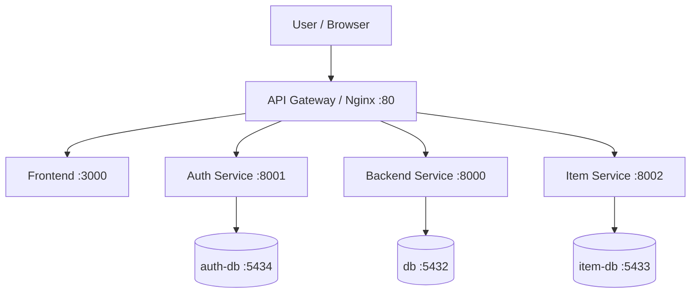

# Microservices Architecture Documentation


## 1. Architecture Diagram



---

## 2. Services & Ports

| Service | Port | Description |
|---|---:|---|
| gateway | 80 | API Gateway / Reverse Proxy |
| frontend | 3000 | Frontend React Application |
| backend | 8000 | Main Backend API |
| auth-service | 8001 | Authentication Service |
| item-service | 8002 | Item Microservice |
| db | 5432 | Main PostgreSQL Database |
| item-db | 5433 | Item Service Database |
| auth-db | 5434 | Authentication Database |

---

## 3. API Contract

Base URL utama:

```text
http://localhost
```

---

### 3.1 Auth Service

#### POST /auth/register

Digunakan untuk registrasi user baru.

URL:

```text
http://localhost/auth/register
```

#### Request

```json
{
  "email": "user@example.com",
  "password": "Pass123",
  "name": "User"
}
```

#### Response

```json
{
  "id": 1,
  "email": "user@example.com",
  "name": "User",
  "role": "parent"
}
```

---

#### POST /auth/login

Digunakan untuk login dan mendapatkan JWT token.

URL:

```text
http://localhost/auth/login
```

#### Request

```json
{
  "email": "user@example.com",
  "password": "Pass123"
}
```

#### Response

```json
{
  "access_token": "jwt_token",
  "token_type": "bearer"
}
```

---

### 3.2 Children Endpoint

#### POST /children

Digunakan untuk menambahkan data anak.

Endpoint ini membutuhkan JWT token.

URL:

```text
http://localhost/children
```

#### Header

```text
Authorization: Bearer TOKEN
```

#### Request

```json
{
  "name": "mark",
  "birth_date": "2023-05-10",
  "gender": "male"
}
```

#### Response

```json
{
  "id": 1,
  "parent_id": 3,
  "name": "mark",
  "birth_date": "2023-05-10",
  "gender": "male",
  "is_active": true
}
```

---

## 4. Running Locally

Menjalankan semua service:

```bash
docker compose up --build -d
```

Melihat daftar container:

```bash
docker compose ps
```

Melihat log semua service:

```bash
docker compose logs -f
```

Menghentikan semua service:

```bash
docker compose down
```

---

## 5. Testing Antar Service

### Langkah Pengujian

#### 1. Register user melalui endpoint `/auth/register`

```powershell
$body = @{
  email = "testbaru@example.com"
  password = "Pass123"
  name = "Test Baru"
} | ConvertTo-Json

Invoke-RestMethod -Method POST -Uri "http://localhost/auth/register" -ContentType "application/json" -Body $body
```

---

#### 2. Login user melalui endpoint `/auth/login`

```powershell
$login = @{
  email = "testbaru@example.com"
  password = "Pass123"
} | ConvertTo-Json

$response = Invoke-RestMethod -Method POST -Uri "http://localhost/auth/login" -ContentType "application/json" -Body $login
```

---

#### 3. Sistem menghasilkan JWT token

```powershell
$TOKEN = $response.access_token
$TOKEN
```

---

#### 4. Token digunakan untuk mengakses endpoint protected `/children`

```powershell
$child = @{
  name = "mark"
  birth_date = "2023-05-10"
  gender = "male"
} | ConvertTo-Json

Invoke-RestMethod -Method POST -Uri "http://localhost/children" `
-ContentType "application/json" `
-Headers @{Authorization="Bearer $TOKEN"} `
-Body $child
```

---

#### 5. Data anak berhasil ditambahkan

Hasil:

```text
id         : 1
parent_id  : 3
name       : mark
birth_date : 2023-05-10
gender     : male
blood_type :
height     :
weight     :
notes      :
is_active  : True
```


---

## 6. Debugging

Melihat log auth-service:

```bash
docker compose logs auth-service
```

Melihat log backend:

```bash
docker compose logs backend
```

Melihat log item-service:

```bash
docker compose logs item-service
```

Melihat log gateway:

```bash
docker compose logs gateway
```

Melihat semua service:

```bash
docker compose ps
```

---

## 7. Hasil Testing

Testing berhasil dilakukan dengan hasil:

- Register user berhasil
- Login berhasil
- JWT token berhasil dibuat
- Endpoint protected berhasil diakses
- Data anak berhasil disimpan ke database
- Gateway berhasil meneruskan request ke service terkait
- Semua container berjalan dengan status healthy

Hasil pengecekan container:

```text
NAME                     STATUS
auth-db                  healthy
auth-service             healthy
backend                  healthy
db                        healthy
frontend                  running
gateway                   running
item-db                   healthy
item-service              healthy
```

---

## 9. Conclusion

Arsitektur microservices berhasil dijalankan menggunakan Docker Compose. API Gateway berhasil menjadi pintu masuk utama aplikasi, proses register dan login berhasil dilakukan, JWT token berhasil dibuat, dan endpoint protected `/children` berhasil diakses menggunakan token.