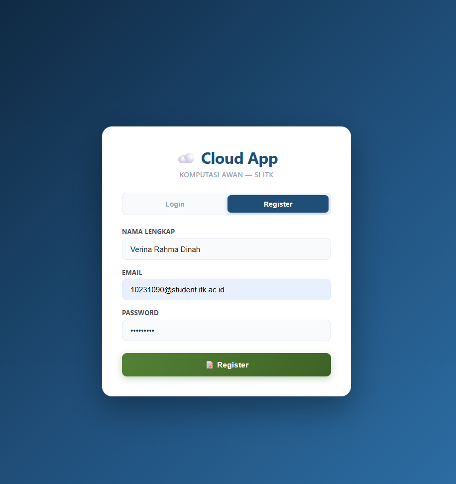
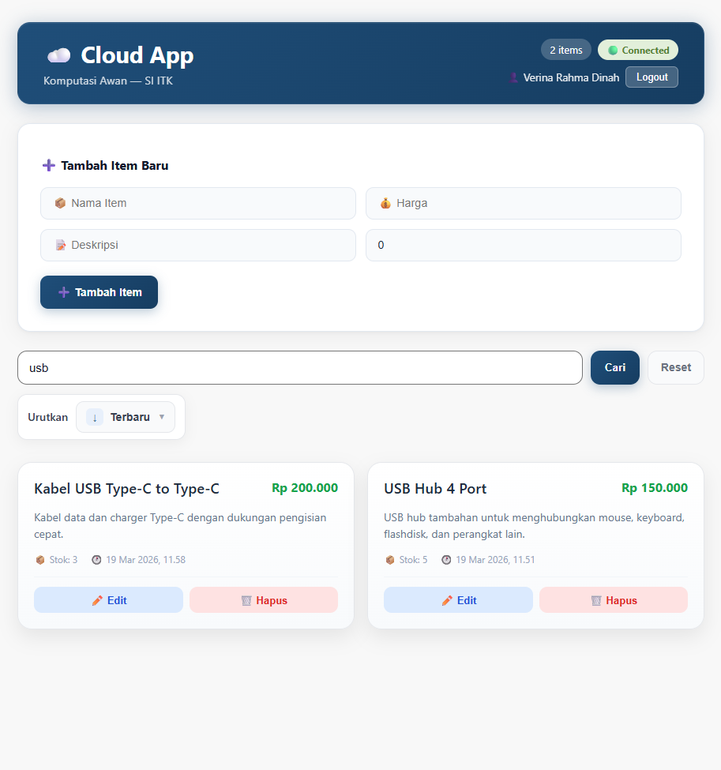
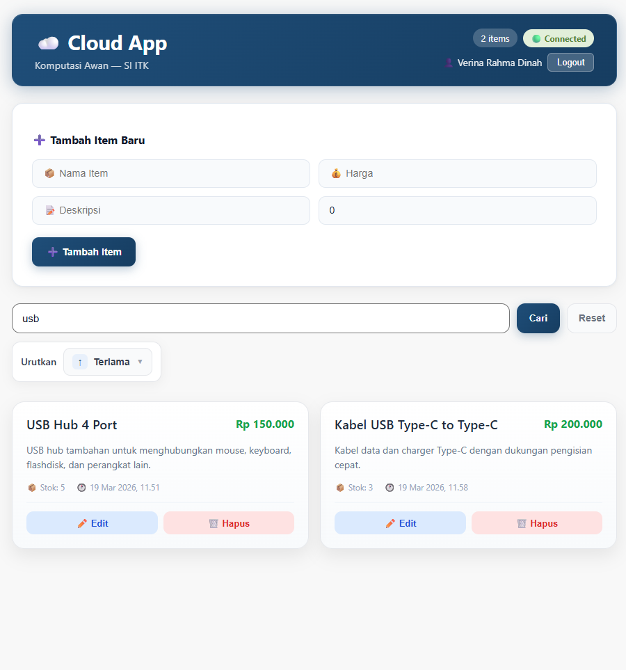
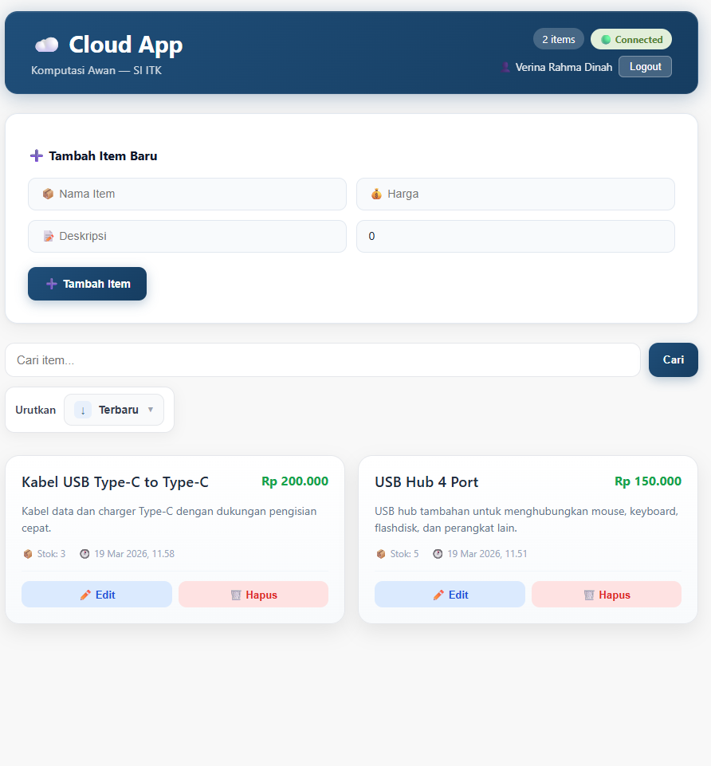
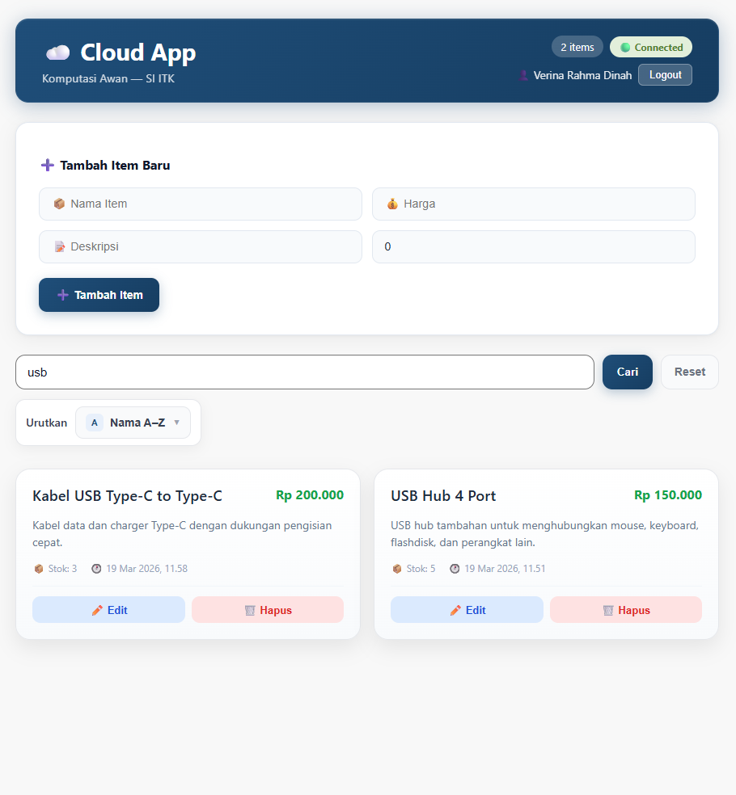
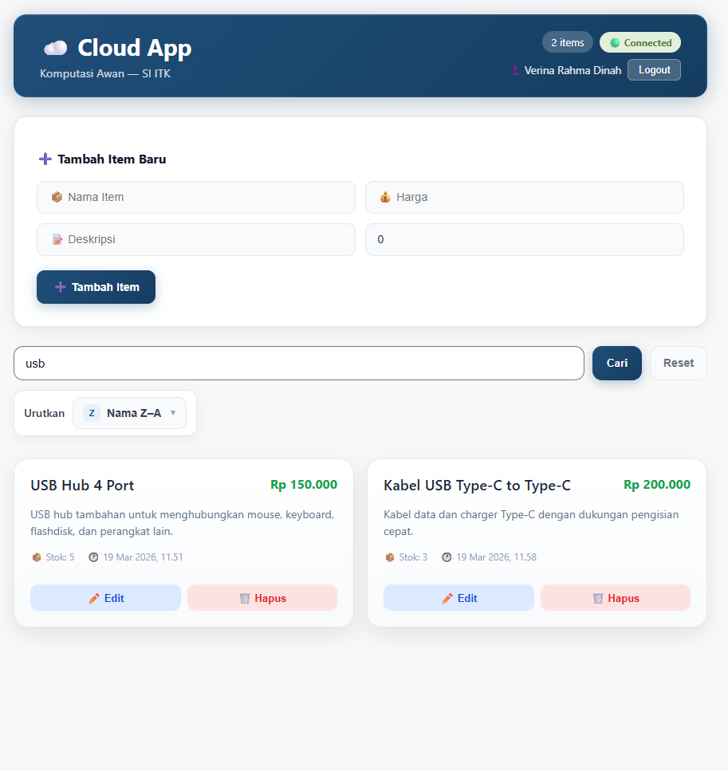
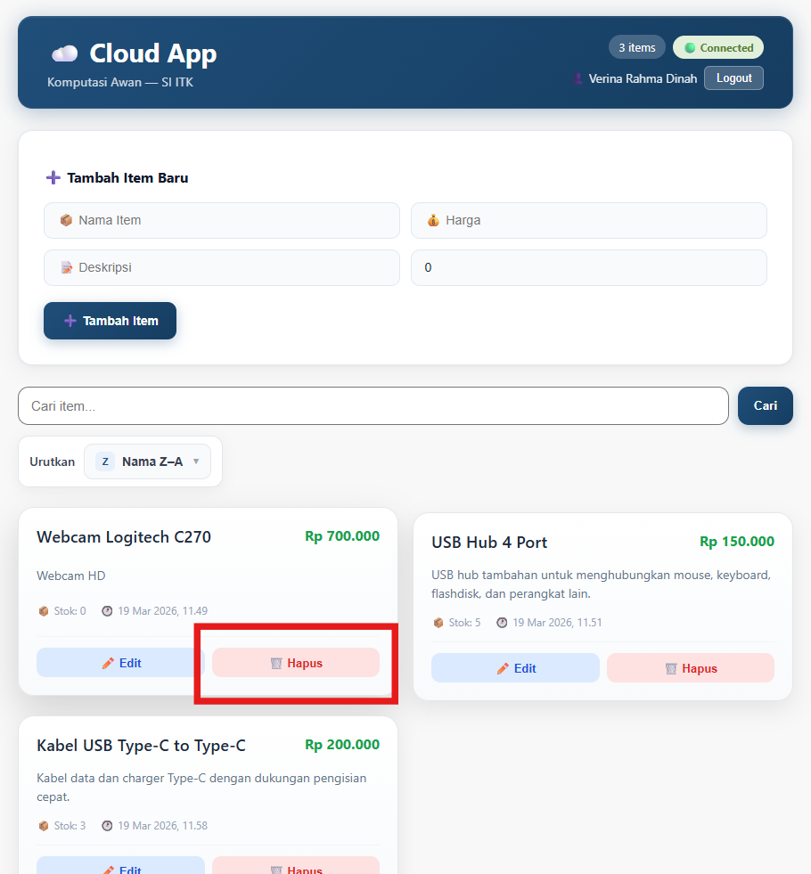
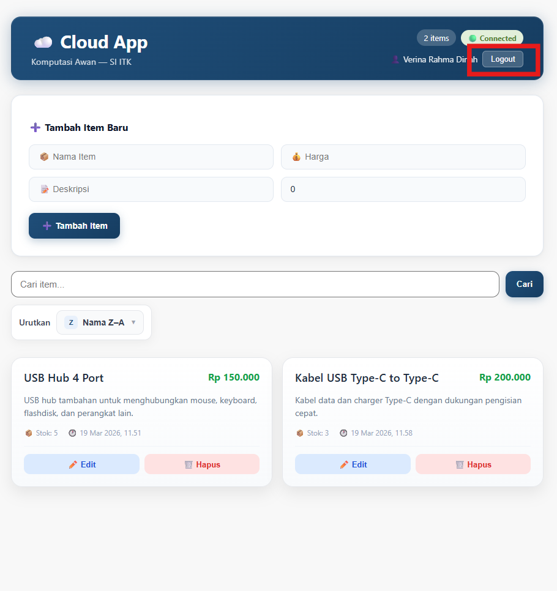

## 📋 Penjelasan Hasil Pengujian Authentication & CRUD

### 1. Halaman login ditampilkan ✅

Hasil pengujian menunjukkan bahwa saat aplikasi pertama kali dijalankan, sistem berhasil menampilkan halaman login sebagai tampilan awal. Hal ini membuktikan bahwa mekanisme autentikasi sudah diterapkan sehingga pengguna harus login terlebih dahulu sebelum mengakses fitur utama aplikasi.

---

### 2. Registrasi user baru ✅

Hasil pengujian menunjukkan bahwa proses registrasi berjalan dengan baik. Pengguna dapat mengisi nama, email, dan password yang valid, lalu sistem berhasil menyimpan akun baru ke dalam database.

---

### 3. Login otomatis setelah registrasi ✅

Hasil pengujian menunjukkan bahwa setelah proses registrasi berhasil, sistem secara otomatis melanjutkan proses login. Dengan demikian, pengguna tidak perlu lagi memasukkan ulang email dan password untuk masuk ke aplikasi.

---

### 4. Halaman utama dan daftar item ditampilkan ✅

Hasil pengujian menunjukkan bahwa setelah login berhasil, aplikasi menampilkan halaman utama beserta daftar item yang tersedia. Hal ini membuktikan bahwa autentikasi berjalan dengan baik dan pengguna yang sudah login dapat mengakses fitur utama aplikasi. Namun, dalam gambar tidak ada daftar item karena item sebelumnya telah dihapus.

---

### 5. Nama user tampil pada header ✅

Hasil pengujian menunjukkan bahwa nama user yang sedang login berhasil ditampilkan pada bagian header aplikasi. Hal ini menandakan bahwa data user berhasil dibaca dan ditampilkan dengan benar setelah proses autentikasi.

---

### 6. Menambahkan item baru ✅

Hasil pengujian menunjukkan bahwa form input item dapat digunakan dengan baik untuk menambahkan data baru. Pengguna dapat mengisi data item yang valid lalu mengirimkannya ke sistem melalui tombol tambah.

---

### 7. Item baru muncul pada daftar ✅

Hasil pengujian menunjukkan bahwa item yang baru ditambahkan berhasil muncul pada daftar item. Hal ini membuktikan bahwa data berhasil disimpan ke database dan frontend mampu memperbarui tampilan secara otomatis.

---

### 8. Mengubah data item ✅

Hasil pengujian menunjukkan bahwa fitur edit berjalan dengan baik. Saat tombol edit dipilih, sistem berhasil memuat data item ke dalam form sehingga pengguna dapat melakukan perubahan pada data yang sudah ada.

Hasil pengujian menunjukkan bahwa setelah perubahan disimpan, data item berhasil diperbarui dan hasil update langsung terlihat pada daftar item. Hal ini membuktikan bahwa proses pembaruan data berjalan dengan benar.

---

### 9. Mencari item ✅

Hasil pengujian menunjukkan bahwa fitur pencarian berfungsi dengan baik. Saat pengguna memasukkan kata kunci tertentu, sistem dapat menampilkan item yang sesuai sehingga memudahkan proses pencarian data.

---

### 10. Mengurutkan produk berdasarkan harga termurah ✅

Hasil pengujian menunjukkan bahwa fitur sorting berdasarkan harga termurah berjalan dengan baik. Daftar produk berhasil diurutkan mulai dari harga paling rendah ke harga yang lebih tinggi.

---

### 11. Mengurutkan produk berdasarkan harga termahal ✅

Hasil pengujian menunjukkan bahwa fitur sorting berdasarkan harga termahal berjalan dengan baik. Daftar produk berhasil diurutkan mulai dari harga paling tinggi ke harga yang lebih rendah.

---

### 12. Mengurutkan produk berdasarkan data terlama ✅

Hasil pengujian menunjukkan bahwa fitur sorting berdasarkan data terlama berfungsi dengan baik. Item ditampilkan mulai dari data yang lebih dahulu dibuat hingga data yang lebih baru.

---

### 13. Mengurutkan produk berdasarkan data terbaru ✅

Hasil pengujian menunjukkan bahwa fitur sorting berdasarkan data terbaru berfungsi dengan baik. Item ditampilkan mulai dari data yang paling baru ditambahkan ke data yang lebih lama.

---

### 14. Mengurutkan produk berdasarkan nama A–Z ✅

Hasil pengujian menunjukkan bahwa fitur sorting berdasarkan nama A–Z berjalan dengan baik. Produk berhasil diurutkan sesuai urutan alfabet dari A ke Z.

---

### 15. Mengurutkan produk berdasarkan nama Z–A ✅

Hasil pengujian menunjukkan bahwa fitur sorting berdasarkan nama Z–A berjalan dengan baik. Produk berhasil diurutkan sesuai urutan alfabet dari Z ke A.

---

### 16. Menghapus item ✅

Hasil pengujian menunjukkan bahwa saat tombol hapus dipilih, sistem berhasil memproses penghapusan item. Proses ini menunjukkan bahwa fitur delete dapat dijalankan sesuai fungsi.

Hasil pengujian menunjukkan bahwa item yang dihapus tidak lagi tampil pada daftar. Hal ini membuktikan bahwa proses penghapusan data berhasil dilakukan dengan benar.

---

### 17. Logout dari aplikasi ✅

Hasil pengujian menunjukkan bahwa tombol logout dapat digunakan dengan baik. Saat tombol ditekan, sistem berhasil mengakhiri sesi login pengguna.

---

### 18. Kembali ke halaman login setelah logout ✅

Hasil pengujian menunjukkan bahwa setelah logout berhasil dilakukan, aplikasi mengarahkan pengguna kembali ke halaman login. Hal ini membuktikan bahwa sesi autentikasi telah dihapus dengan benar.

---

### 19. Login kembali dengan akun yang sama ✅

Hasil pengujian menunjukkan bahwa pengguna dapat kembali login menggunakan akun yang sama setelah sebelumnya logout. Hal ini membuktikan bahwa akun tetap tersimpan dengan baik di database dan dapat digunakan kembali.

---

### 20. Data item tetap tersedia setelah login ulang ✅

Hasil pengujian menunjukkan bahwa setelah pengguna login kembali, data item yang sebelumnya telah tersimpan tetap tersedia dan dapat ditampilkan pada aplikasi. Hal ini membuktikan bahwa data tersimpan secara permanen di database dan tidak hilang setelah sesi logout.

---

### 21. Menampilkan empty state setelah semua item dihapus ✅

Jika seluruh item pada daftar dihapus, aplikasi akan menampilkan kondisi empty state. Hal ini menunjukkan bahwa sistem mampu menyesuaikan tampilan ketika tidak ada data yang tersedia, sehingga antarmuka tetap informatif bagi pengguna.