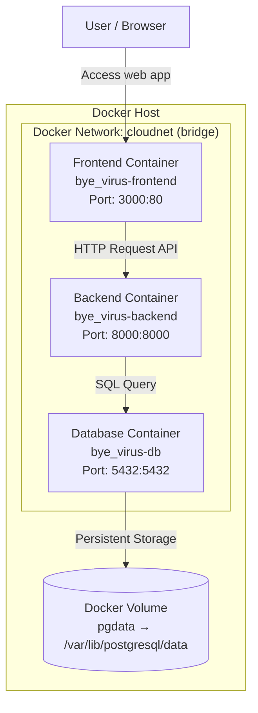

# Docker Architecture

Dokumen ini menjelaskan arsitektur deployment aplikasi **Bye Bye Virus** menggunakan **3 container utama**, yaitu:

1. **Database** → PostgreSQL
2. **Backend** → FastAPI
3. **Frontend** → React + Nginx

Arsitektur ini dirancang agar setiap layanan berjalan terpisah, tetapi tetap saling terhubung melalui **network Docker yang sama**, sehingga lebih mudah dikelola, dikembangkan, dan di-deploy.

---

## 1. Gambaran Umum Arsitektur

Sistem terdiri dari 3 container:

- **db**  
  Menyimpan seluruh data aplikasi menggunakan PostgreSQL.

- **backend**  
  Menyediakan API utama untuk autentikasi, pengelolaan data, dan komunikasi dengan database.

- **frontend**  
  Menyediakan antarmuka pengguna berbasis web dan berkomunikasi dengan backend melalui HTTP API.

Semua container berada dalam satu network bernama **`cloudnet`**, sehingga bisa saling berkomunikasi menggunakan nama servicenya.

---

## 2. Diagram Arsitektur

Diagram tersebut menunjukkan alur kerja dan hubungan antar komponen dalam arsitektur Docker aplikasi **Bye Bye Virus**.

- **User / Browser**  
  Bagian ini menunjukkan pengguna yang mengakses aplikasi melalui browser. User tidak berinteraksi langsung dengan backend maupun database, tetapi masuk terlebih dahulu ke frontend.

- **Docker Host**  
  Merupakan lingkungan utama tempat seluruh container dijalankan. Di dalam Docker Host inilah semua service aplikasi berjalan secara terisolasi.

- **Docker Network: `cloudnet` (bridge)**  
  Network ini menghubungkan seluruh container agar dapat saling berkomunikasi. Karena frontend, backend, dan database berada pada network yang sama, masing-masing service dapat saling mengakses sesuai kebutuhannya.

- **Frontend Container (`bye_virus-frontend`)**  
  Container ini berfungsi menampilkan antarmuka aplikasi kepada user. Frontend menerima akses dari browser melalui port **3000:80**. Artinya, user mengakses aplikasi dari port 3000 di host, lalu diteruskan ke port 80 di dalam container frontend.

- **Backend Container (`bye_virus-backend`)**  
  Container ini berfungsi sebagai API server dan pusat logika aplikasi. Backend menerima request dari frontend melalui HTTP API pada port **8000:8000**, lalu memproses data, autentikasi, dan operasi sistem lainnya.

- **Database Container (`bye_virus-db`)**  
  Container ini menggunakan PostgreSQL untuk menyimpan data aplikasi. Backend akan mengirim query SQL ke database melalui port **5432:5432** untuk membaca atau menulis data.

- **Docker Volume (`pgdata → /var/lib/postgresql/data`)**  
  Volume ini digunakan untuk menyimpan data database secara persisten. Jadi, walaupun container database dihentikan, dihapus, atau dibuat ulang, data tetap tersimpan di volume dan tidak hilang.

### Makna Alur Panah pada Diagram

- **User → Frontend (`Access web app`)**  
  Menunjukkan bahwa user mengakses aplikasi web melalui browser, dan request pertama masuk ke frontend.

- **Frontend → Backend (`HTTP Request API`)**  
  Menunjukkan bahwa frontend tidak memproses data utama sendiri, tetapi mengirim request ke backend melalui API.

- **Backend → Database (`SQL Query`)**  
  Menunjukkan bahwa backend berkomunikasi dengan database untuk mengambil, menambah, mengubah, atau menghapus data.

- **Database → Volume (`Persistent Storage`)**  
  Menunjukkan bahwa data pada database disimpan ke volume Docker agar tetap persisten.

## 3. Penjelasan Alur Kerja Sistem

Secara umum, alur kerja sistem adalah sebagai berikut:

1. **User** mengakses aplikasi melalui browser pada port **3000**.
2. Request masuk ke container **frontend** yang menampilkan antarmuka aplikasi.
3. Saat user login, melihat data, atau mengirim form, **frontend** akan mengirim request ke **backend** melalui API.
4. Container **backend** memproses logika aplikasi, validasi data, autentikasi, dan query ke database.
5. Container **db** menyimpan atau mengembalikan data sesuai permintaan backend.
6. Hasil dari backend dikirim kembali ke frontend, lalu ditampilkan ke user.

Dengan demikian, **frontend** tidak langsung mengakses database, tetapi harus melalui **backend**. 

---

## 4. Penjelasan Tiap Container

### 4.1 Database Container (`db`)

Container database menggunakan image `postgres:16-alpine` untuk menyimpan seluruh data aplikasi.

- **Port:** `5432:5432`
- **Volume:** `pgdata:/var/lib/postgresql/data`
- **Network:** `cloudnet`
- **Environment Variables:**
  - `POSTGRES_USER=postgres`
  - `POSTGRES_PASSWORD=postgres`
  - `POSTGRES_DB=bye_virus`

### 4.2 Backend Container (`backend`)

Container backend berfungsi sebagai API server dan penghubung antara frontend dengan database.

- **Port:** `8000:8000`
- **Network:** `cloudnet`
- **Env file:** `./backend/.env.docker`
- **Depends on:** `db` *(menunggu database dalam kondisi sehat)*

Contoh environment variables pada backend:

- `DATABASE_URL`
- `SECRET_KEY`
- `ALGORITHM`
- `ACCESS_TOKEN_EXPIRE_MINUTES`

### 4.3 Frontend Container (`frontend`)

Container frontend berfungsi untuk menampilkan antarmuka website kepada user.

- **Port:** `3000:80`
- **Network:** `cloudnet`
- **Build args:**
  - `VITE_API_URL=http://localhost:8000`
- **Depends on:** `backend`

---

## 5. Network

Project ini menggunakan network dengan konfigurasi sebagai berikut:

- **Nama:** `cloudnet`
- **Driver:** `bridge`

Network ini memungkinkan semua container saling terhubung dalam satu lingkungan Docker sehingga komunikasi antar layanan dapat berjalan dengan baik.

---

## 6. Volume

Project ini menggunakan volume dengan detail sebagai berikut:

- **Nama:** `pgdata`
- **Digunakan oleh:** container database
- **Fungsi:** menyimpan data PostgreSQL agar tetap tersedia meskipun container dihentikan atau dibuat ulang

Dengan adanya volume, data aplikasi tidak akan hilang hanya karena container database di-restart atau dihapus.

