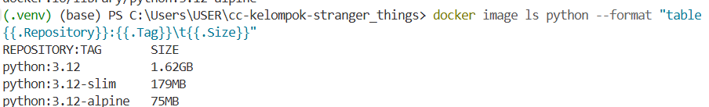

## Python Image Comparison

Perbandingan ukuran image Docker berdasarkan hasil `docker image ls`.



---

| Image | Size |
|---|---:|
| python:3.12 | 1.62GB |
| python:3.12-slim | 179MB |
| python:3.12-alpine | 75MB |

## Notes

- `python:3.12` adalah image paling besar.
- `python:3.12-slim` jauh lebih kecil dibanding image default.
- `python:3.12-alpine` adalah yang paling kecil.

## Command used

```bash
docker pull python:3.12
docker pull python:3.12-slim
docker pull python:3.12-alpine
docker image ls python --format "table {{.Repository}}:{{.Tag}}\t{{.Size}}"